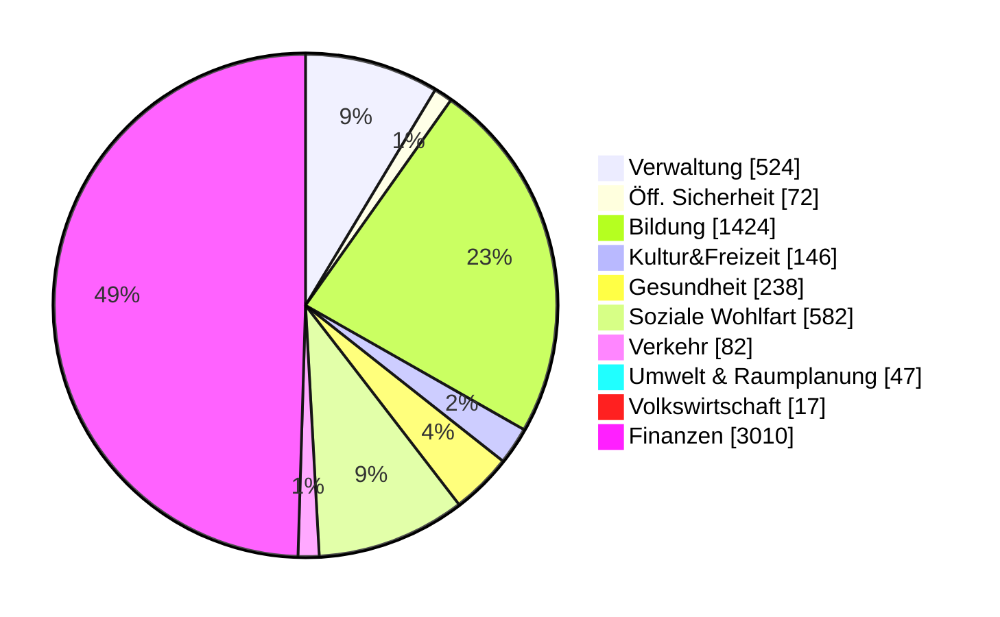
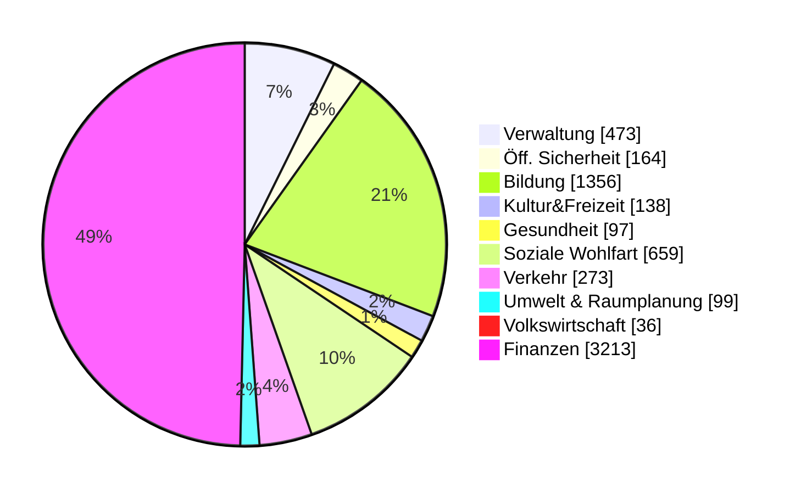
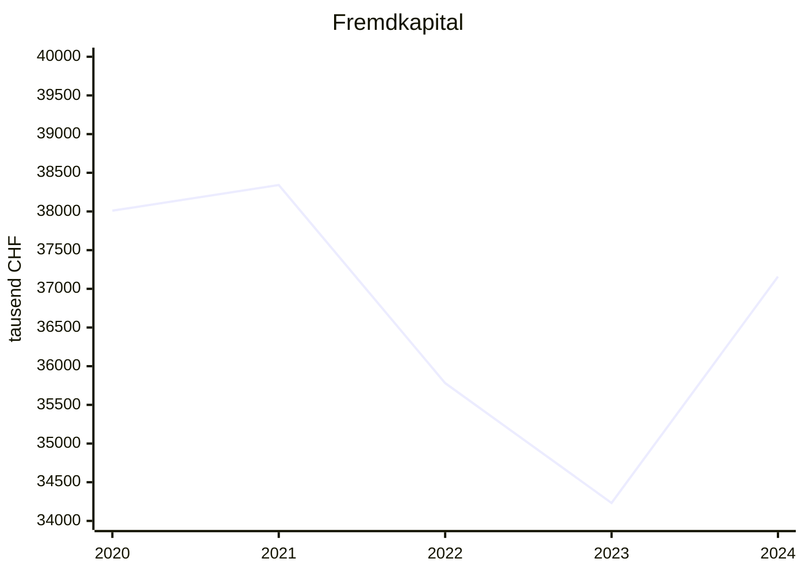
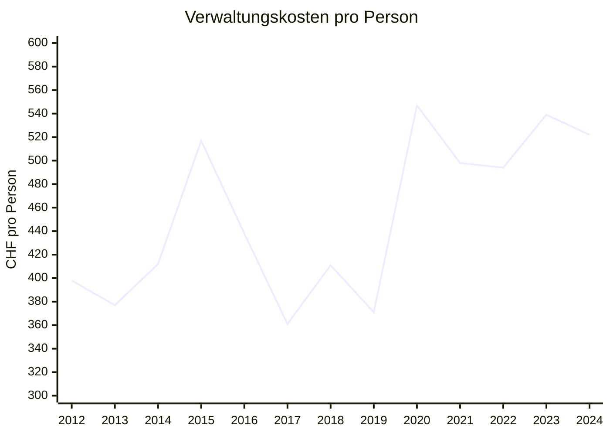
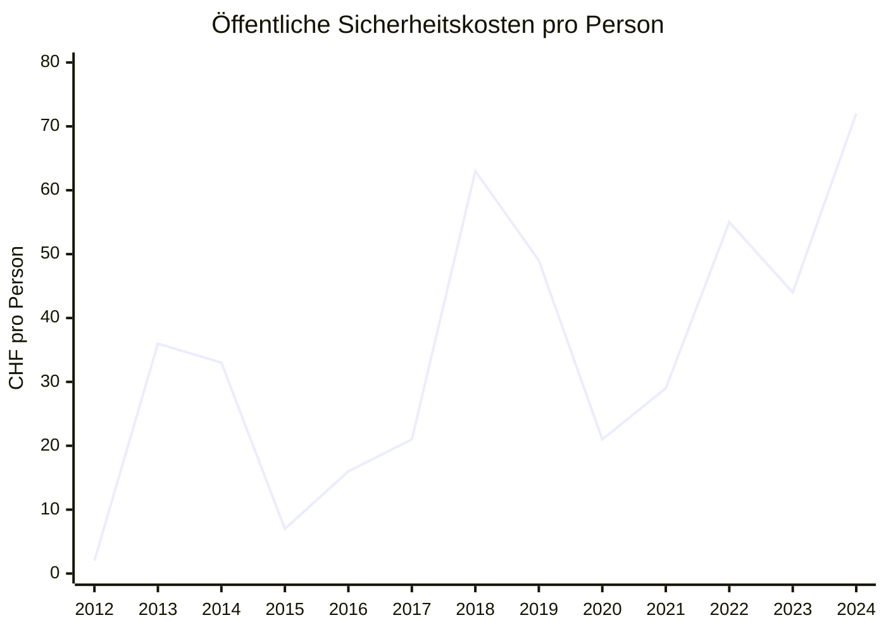
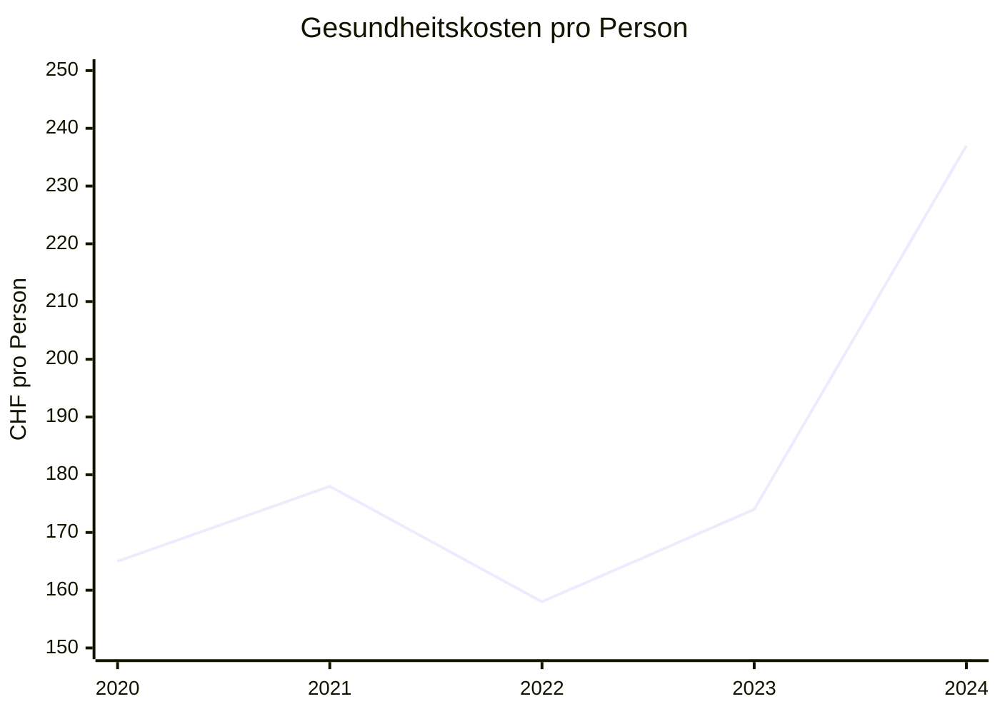
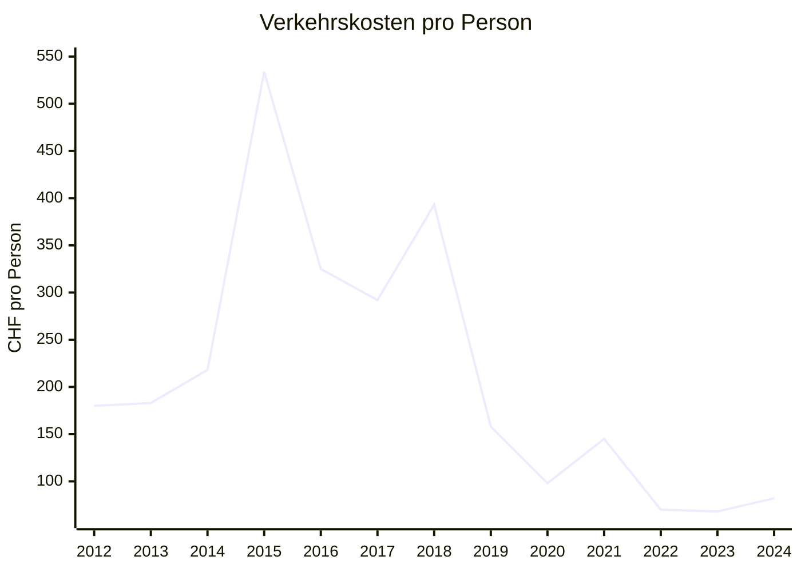
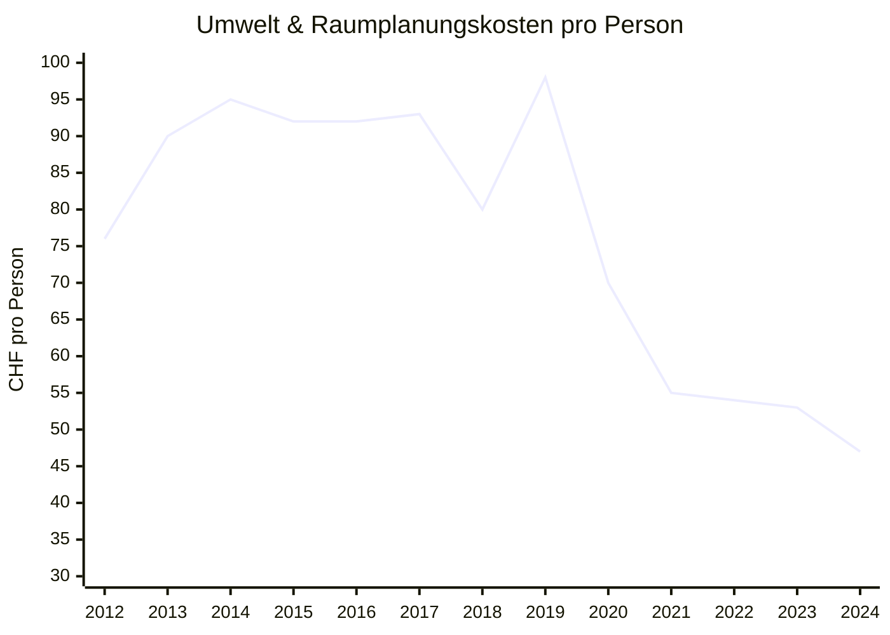

# Finanzen der Gemeinde Beringen

Ich erstellte einige Graphen aus den Rechnungen und den Budgets der Gemeinde Beringen. Eventuell machte ich ein paar Fehler. Wenn dir einer auffällt, lass es mich wissen.

## Ausgaben pro Einwohner:in in Beringen

&nbsp;
{:#mermaid}

Beringen nimmt pro Einwohner:in CHF 3010 pro Jahr ein und gibt etwa genau so viel aus (CHF 3133). Diese Daten sind wenig aussagekräftig. Wir können das aber mit einer Nachbargemeinde vergleichen:

## Vergleich mit Neunkirch

&nbsp;
{:#mermaid}

Solche Vergleiche erlauben (beispielsweise als Geschäftsprüfungskomissionsmitglied) zu beurteilen, wo genauer nachgeforscht werden sollte.

# Entwicklung

Ebenso ist die Entwicklung dieser Zahlen wichtig. Sind die Zahlen ansteigend oder sinkend? So wird beispielsweise wieder und wieder behauptet, die Verschuldung von Beringen sei zu hoch, aber die Zahlen belegen das nicht. Die Schulden sind stabil zwischen 34 und 39 Millionen oder ca. CHF 7000 pro Einwohner:in.

&nbsp;
{:#mermaid}

## Negative Entwicklungen

Einige nennenswerte Entwicklungen sind die Ausgaben pro Person, bezogen auf die Kategorien. Folgende sind sich am Erhöhen und es ist vielleicht sinnvoll, sie genauer im Auge zu halten.

&nbsp;
{:#mermaid}

&nbsp;
{:#mermaid}

&nbsp;
{:#mermaid}

Ich wählte hier den Start bei 2020, weil es dort einen Systemwechsel gab und die Kosten darum nicht vergleichbar sind.

## Positive Entwicklungen

Auf der anderen Seite gibt es Trends, die erfreulich sind.

&nbsp;
{:#mermaid}

&nbsp;
{:#mermaid}

# Stimmt das Budget?

Das Budget muss jedes Jahr erstellt werden. Es soll Orientierung liefern, wie die Ausgaben und Einnahmen im kommenden Jahr sein werden. Doch dieses eigentlich analytische Instrument ist immer wieder ein Werkzeug, um politische Macht auszuüben, und wird verwendet, um eine Geschichte zu erzählen, anstatt einen realistischen Blick in die Zukunft zu werfen. So betrachten wir hier die Diskrepanz zwischen Budget und Rechnung. Es sei angemerkt, dass im Jahr 2021 eine unerwartet grosse Steuerzahlung aus der Wirtschaft eintraf. Es gibt jedes Jahr ein paar Dinge, die nicht einkalkuliert wurden. Doch im Durchschnitt gleichen sie sich wieder aus.

Ich konnte die Budgets und Rechnungen bis ins Jahr 2020 vergleichen. Für die früheren Jahre stand mir das Budget nicht zur Verfügung.
{:#budget}

| Jahr | Rechnung (CHF) | Budget (CHF) | Differenz (CHF) |
|------|----------------|--------------|-----------------|
| 2020 | -230,101       | -328,630     | -98,529         |
| 2021 | 1,066,430      | -205,694     | -1,272,124      |
| 2022 | 124,426        | -68,785      | -193,211        |
| 2023 | 151,917        | -197,471     | -349,388        |
| 2024 | -647,740       | -784,180     | -136,440        |

Das Budget war noch nie schlechter als die Rechnung. Im Durchschnitt ist es CHF 409'000 zu pessimistisch und im Median CHF 193'000. Diese Abweichung scheint systematisch zu sein. So wird pessimistisch budgetiert, um Sparmassnahmen zu rechtfertigen oder zumindest Argumente gegen neue Ausgaben zu haben. Auch kann sich der Gemeinderat selbst immer wieder ein Kränzchen binden, da er ja besser abgeschlossen hat als budgetiert. Gerade letztes Jahr (2024) wäre noch viel positiver ausgefallen, wäre diese unerwartete Steuerrückzahlung nicht geschehen. Ich möchte mich ja nicht über eine gute Rechnung beklagen, aber das ist aus meiner Sicht etwas Augenwischerei und ein Missbrauch dieses Instruments. Ich verurteile es nur bedingt, da Budgets überall zu den genannten Zwecken missbraucht werden. Aber dennoch möchte ich es hier festhalten.
