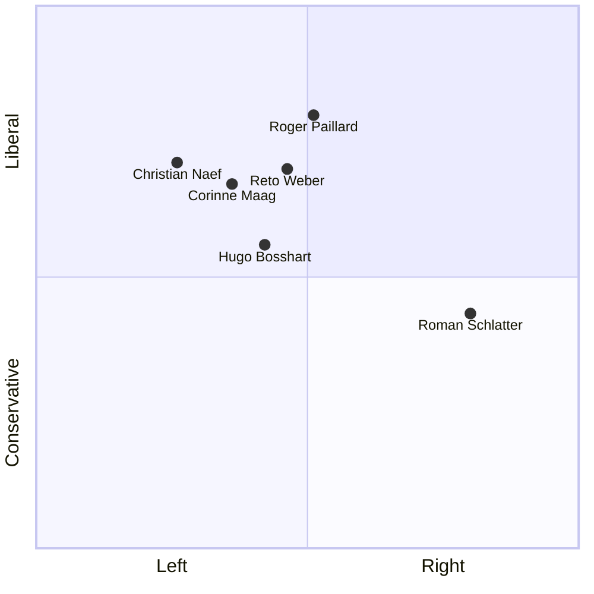
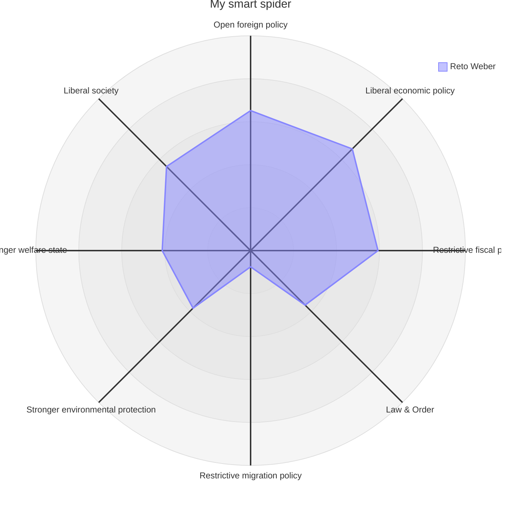

# Residents' Council

Since early 2025, I have been an elected member of the [Residents' Council](https://www.beringen.ch/de/mitglieder) in Beringen. I represent the interests of the population on behalf of the [EVP](https://evp-sh.ch).

In addition, I am a member of the [Civil Engineering Commission](https://www.beringen.ch/de/tiefbau), the [Swimming Pool Commission](https://www.beringen.ch/de/schwimmbad), and the [party executive board](https://www.evp-sh-2024.ch/parteivorstand) of our cantonal party.

# Smartvote

My political positions as measured by [smartvote](https://smartvote.ch):

<!-- Roman Schlatter: https://www.smartvote.ch/de/group/527/election/23_ch_nr/smartmap -->
<!-- https://www.smartvote.ch/de/group/540/election/24_sh_leg/smartmap -->

&nbsp;
{:#mermaid}

The [data](https://www.smartvote.ch/de/group/540/election/24_sh_leg/smartmap) for the other participants. I could not find the remaining members of the Residents' Council or the municipal council online.

&nbsp;
{:#mermaid}

# Public votes

I only cover proposals where I have a personal connection. That is mainly local (municipal) ballots and elections, but occasionally also cantonal or federal ones if I feel competent to comment.

## 30. November 2025

### Construction credit for the new Werkhof building (Werkstrasse, Beringen)

This is being put to a vote because the construction project costs more than CHF 600'000 (see [Constitution of Beringen](https://www.beringen.ch/uploads/files/pdf/Beringen%20Online/Rechtsbuch/100.000%20Verfassung%20der%20Einwohnergemeinde%20Beringen.pdf), Art. 16d).

I support the new building. It corresponds to the popular will: voters approved the planning credit, and the planned Werkhof matches what was defined back then.

Some will say, “This is a good project for the people of Beringen.” Others will say, “It is too expensive.” For me, neither point changes the conclusion: the Werkhof staff urgently needs a new home, and an alternative project would not be cheaper. It would trigger new planning work and require an interim solution, which also costs money.

Since the project matches what was already described in the planning credit—and that credit was approved by the voters—I see no good reason to block it now. A “no” would likely end up costing more than a “yes”. A “yes” gives the Werkhof a solid new building.

I created a [page](/politik/werkhof-baukredit/) with neutral facts about the ballot.

> Voters approved the construction credit ([link](https://www.beringen.ch/uploads/files/pdf/Behoerde-Politik/Abstimmungen-Wahlen/2025/2025%2011%2030%20Gemeinde.pdf)). That does not surprise me much: the Werkhof is one of the most visible services the municipality provides and it has broad support.

## 28. September 2025

### E-ID talk

{:.float-right}
On 4 September I gave a public talk on the E-ID in the run-up to the national vote. I helped develop the E-ID and explained how it works technically, and I stayed for questions. ([more info](/politik/e-id))

> The proposal passed by a very small margin ([link](https://www.bk.admin.ch/ch/d/pore/va/20250928/index.html)). In Schaffhausen, approval was significantly lower ([link](https://sh.ch/CMS/get/file/f821997c-7d41-43d0-b24c-89d342385f0d)).

### Referendum on the partial revision of land-use planning

The referendum was launched. I supported the municipal council’s proposal and opposed the referendum. I also made myself available for campaign flyers. This stance is consistent with my vote on [6 May 2025](#6-mai-2025).

The campaign disappointed me a bit on both sides:

- On the **pro side** (where I stand), my face and my argument were printed. But I am one of the least influential politicians in Beringen: I received 212 votes; only Thomas Widmer received a similarly low number (237). Everyone else had more than double that. Yet nobody with a larger base was willing to publicly support the proposal.
- On the **contra side**, the claim was promoted that the land was being rezoned too cheaply. There was in fact a proposal on the table that would have secured more money for the municipality, but it was rejected by those who later became the opponents.

I created a [page](/politik/zonenplanaenderung/) with neutral facts about the ballot. For local issues, this kind of information has often been missing in the past; I want to keep producing it.

> Voters rejected the zoning change ([link](https://www.beringen.ch/uploads/files/pdf/Behoerde-Politik/Abstimmungen-Wahlen/2025/2025%2009%2028%20Bund%20und%20Gemeinde.pdf)), which I find unfortunate. It is also a reality check for us in the Residents' Council: almost all parties supported it; many council members supported it. But voters did not.

# Votes and elections in the Residents' Council {: .vote}

Here I give an account of how I voted or whom I elected in the Residents' Council. The proposals can be found on the municipality’s [website](https://www.beringen.ch/de/einwohnerrat-vorlagen).

## 9. December 2025

[Link](https://www.beringen.ch/uploads/files/pdf/Behoerde-Politik/Einwohnerrat/Beschluesse/2025/Einwohnerrat%20Beschluesse%205.%20Sitzung%20vom%209.%20Dezember%202025.pdf)

| My vote | Council decision | Proposal |
| --- | --- | --- |
| ✓ | ✓ | Lukas Rüedlinger (SP list) is elected as the new president of the Residents' Council. Beatrix Delafontainer (FDP) is elected vice president, and Thomas Widmer (SVP) is elected deputy clerk. |
| ✓ | ✓ | The budget is adopted and the municipal tax rate remains at 91%. |
| - | ✗ | A motion to increase the tax rate by 3% is narrowly rejected. |

> The budget sparked a lot of debate. Debt is rising, and Roman Schlatter for example demanded a stronger saving effort from the municipal council (or criticised a lack of willingness to save). Lukas Rüedlinger proposed raising the tax rate to counteract the debt. His arguments included: the canton reduced taxes by 3%, so the net burden would remain roughly stable; and we have a responsibility for the municipality and should take measures. Counterarguments were: the debt is not that bad; and raising taxes without a credible saving plan is the wrong approach. I could not form a clear opinion and abstained.

## 23. September 2025

[Link](https://www.beringen.ch/uploads/files/pdf/Behoerde-Politik/Einwohnerrat/Beschluesse/2025/Einwohnerrat%20Beschluesse%204.%20Sitzung%20vom%2023.%20September%202025.pdf)

| My vote | Council decision | Proposal |
|---|---|---|
| ✓ | ✓ | Construction credit for the new Werkhof building on Werkstrasse |
| ✓ | ✓ | Total credit for implementing the lighting concept (public lighting) |
| ✗ | ✗ | Miscellaneous: motion to move the meeting start from 20:00 to 19:30 |

> The new Werkhof building led to a long debate. The main criticism was that the project was too expensive and that too many vehicles might have to remain outside. My view from the start was: this is too late for a fundamental change. We are no longer in the planning phase. The cost had been stated as 5.3 million (± 30%); it is now 4.9 million (± 10%). From my perspective, the municipal council has implemented what it announced and was mandated to do. In addition, voters approved the planning credit; saying “no” to a project that matches those specifications feels paternalistic to me. The proposal is subject to a mandatory referendum because it is expensive.

## 1. July 2025

[Link](https://www.beringen.ch/uploads/files/pdf/Behoerde-Politik/Einwohnerrat/Beschluesse/2025/Einwohnerrat%20Beschluesse%203.%20Sitzung%20vom%201.%20Juli%202025.pdf)

| My vote | Council decision | Proposal |
|---|---|---|
| ✓ | ✓ | Annual accounts 2024 of the municipality of Beringen |
| ✓ | ✓ | Sale of parcel no. 1848 in Beringen. The parcel along Schaffhauserstrasse is sold to the Migros Cooperative Federation for a total of CHF 305'760.00. If a multi-purpose strip along Schaffhauserstrasse is planned and part of the parcel is transferred to the canton of Schaffhausen, the portion sold to Migros will be reduced accordingly. In that case as well, the purchase price is CHF 490.00 per m². Land Registry Office costs are borne by the buyer in all cases. |

> I liked that a proposal from the Residents' Council turned into a concrete proposal within half a year. The new traffic routing near Migros had been raised in the December meeting and has now been set in motion.

---

## 6. May 2025

[Link](https://www.beringen.ch/uploads/files/pdf/Behoerde-Politik/Einwohnerrat/Beschluesse/2025/Einwohnerrat%20Beschluesse%202.%20Sitzung%20vom%206.%20Mai%202025.pdf)

| My vote | Council decision | Proposal |
|---|---|---|
| ✓ | ✗ | Motion by [Michael Bizic](https://www.garbatec.ch/garbatec/team) on the partial revision of land-use planning: to refer the proposal back to the municipal council, arguing that point 5 should be renegotiated (compensation to the municipality of Beringen). The suggested new terms were 40 rappen per cubic metre of gravel leaving the pit, and 30 rappen per cubic metre of fill material brought back in. |
| ✓ | ✓ | Partial revision of land-use planning regarding the zoning change in the Hooloo/Hinderi Laufferstaag area, and the related change to the building and land-use regulations. |

> I considered Michael Bizic’s motion worth supporting and would have preferred it, but it was rejected 5 to 4 with 1 abstention. Still, I preferred the original proposal over having nothing at all.

---

## 14. January 2025

[Link](https://www.beringen.ch/uploads/files/pdf/Behoerde-Politik/Einwohnerrat/Beschluesse/2025/Einwohnerrat%20Beschluesse%201.%20Sitzung%20vom%2014.%20Januar%202025.pdf)

| My vote | Council decision | Proposal |
|---|---|---|
| - | ✓ | Elected as a vote counter. |
| ✓ | ✓ | In various elections I voted for the proposed candidates. |
| ✓ | ✓ | Proposal to adjust the school leadership workload as a consequence of the requirements for the canton-wide introduction of managed schools in the canton of Schaffhausen |
| ✓ | ✓ | Final accounts for the redesign of the Trasadingerstrasse H13 – Haardaublick intersection (Bömmliacker Ost), gross CHF 295'472.95 |
| ✓ | ✓ | Final accounts for the purchase of a new municipal vehicle for building maintenance, gross CHF 114'393.80 |

> I was nervous in this first meeting. Even though counting votes is not difficult, doing it while nervous was a small challenge. During the discussion of the “purchase of a new municipal vehicle”, I asked why the old vehicle had been sold so cheaply. Hugo Bosshart (head of civil engineering) answered the question satisfactorily in the moment. In hindsight, I should have followed up more; the price really was too low.

---
