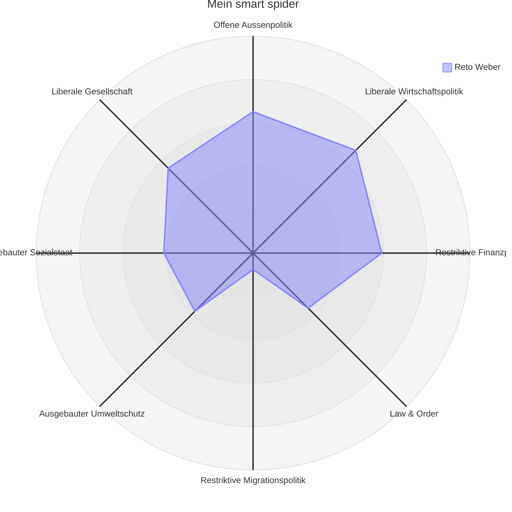

# Population

Since the beginning of 2025, I have been elected member of [Population](https://www.beringen.ch/de/mitglieder) in Beringen. I represent the interests of the population on behalf of [EPP](https://evp-sh.ch).

In addition, I am a member of the [Civil engineering](https://www.beringen.ch/de/tiefbau), [Swimming pool](https://www.beringen.ch/de/schwimmbad) and [Chief Party](https://www.evp-sh-2024.ch/parteivorstand) of our cantonal party.

# Smartvote
My political stances are determined via [smatvote](https://smartvote.ch): 

<!-- Roman Schlatter: https://www.smartvote.ch/de/group/527/election/23_ch_nr/smartmap -->
<!-- https://www.smartvote.ch/de/group/540/election/24_sh_leg/smartmap -->

&nbsp;
{:#mermaid}

The [Data](https://www.smartvote.ch/de/group/540/election/24_sh_leg/smartmap) of the other participants. I did not find the non-listed local councils and municipal councils online.

&nbsp;
{:#mermaid}

# referendums

I'm just treating business to which I have a reference. These are, above all, municipal votes and elections, but also cantonal or federal, when I see myself as expertly competent.

## 30. November 2025

### Construction loan to the new building of the Beringen plant at the Werkstrasse

This is the vote because the construction project costs more than CHF 600'000 (see: [Constitution Beringen](https://www.beringen.ch/uploads/files/pdf/Beringen%20Online/Rechtsbuch/100.000%20Verfassung%20der%20Einwohnergemeinde%20Beringen.pdf) Art. 16d). I know the new building. It corresponded to the popular will, because this has agreed to the planning loan and the planned workshop corresponds to what was defined at that time. There will be many who say, "This is a good project for the Beringer population." or others who will say, "This is too expensive." But for me this is both irrelevant. The factory staff urgently needs a new stay. An alternative construction will not be cheaper, as it creates a new planning and the workshop needs an intermediate solution that will not be free. The project also corresponds to what has already been described in the planning loan and this has been well done by the people. Although we have the political means to prevent this new building, I do not see any reason to do so. A no would probably come more expensive than a yes. And a yes gives the workshop a good new building.

I created an [Page](/politik/werkhof-baukredit/) with neutral facts for the vote.

> The people approved the construction loan ([Link](https://www.beringen.ch/uploads/files/pdf/Behoerde-Politik/Abstimmungen-Wahlen/2025/2025%2011%2030%20Gemeinde.pdf)). It amazes me little, because the factory farm is one of the most visible services of the municipality and has a broad support in the community.

## 28. September 2025

### E-ID Lecture

{:.float-right}
On 4 September I gave a public lecture on the E-ID on the occasion of the national vote. I developed the E-ID and told about the technical function and was available for questions. ([more info](/politik/e-id))

> The people took the submission very close to [Link](https://www.bk.admin.ch/ch/d/pore/va/20250928/index.html). In Schaffhausen the approval was significantly smaller [Link](https://sh.ch/CMS/get/file/f821997c-7d41-43d0-b24c-89d342385f0d).

### Referendum for partial revision of usage planning

The referendum was taken. I supported the presentation of the municipal council and rejected the referendum. I made myself available to be printed on flyers. This attitude agrees with my voice at [6. May 2025](#6-mai-2025).

I am somewhat disappointed by the vote.

- On the **"Pro" page to which I belong, my face and argument were printed. But I am the least influential politician in the whole of Beringen. I just had 212 voices only Thomas Widmer had only 237 voices and all others had over twice as many voices; but no one has agreed to speak publicly for the presentation. Maybe because of any suspicion? But why didn't they quit the council meeting?
- On the ** "Contra" page**, it is now advertised that the country is zoomed too cheaply. But there was a suggestion on the table that wanted to get more money out for the community, but this was not good-heeled by the present opponents.

I created an [Page](/politik/zonenplanaenderung/) with neutral facts about the vote. More this information was missing in the past for municipal business. I'm trying to create this in the future.

> The people refused to change the zone plan ([Link](https://www.beringen.ch/uploads/files/pdf/Behoerde-Politik/Abstimmungen-Wahlen/2025/2025%2009%2028%20Bund%20und%20Gemeinde.pdf)), which I find a pity. It's also a real check for us in the council. Almost all parties were for it. Very many councils were for it. But the people are opposed.

# Voting and elections in the Council of Inhabitants {: .vote}

This is where I am accountable for what I have voted or elected in the Council of Inhabitants. The templates can be found on the [Website](https://www.beringen.ch/de/einwohnerrat-vorlagen) of the municipality of Beringen.

## 9. December 2025

[Link](https://www.beringen.ch/uploads/files/pdf/Behoerde-Politik/Einwohnerrat/Beschluesse/2025/Einwohnerrat%20Beschlusse%205.%20Sitzung%20vom%209.%20Dezember%202025.pdf)

| My voice | Council of Inhabitants | Name of the template |
| --- | --- | --- |
| ✓ | ✓ | Lukas Rüedlinger (SP list) is elected as the new President of the Council of Residents. Beatrix Delafontainer (FDP) is elected as the new Vice President of the Council of Residents and Thomas Widmer (SVP) is elected to represent the Aktuarin. |
| ✓ | ✓ | Budget was adopted and the tax base was left to 91%. |
| - | ✗ | 3 % increase was rejected. |

> The budget gave a lot to discuss. The debt is higher and, for example, Roman Schlatter demanded a savings rate from the municipal council, or criticised a lack of readiness to save. Lukas Rüedlinger requested that the tax fund be increased to counter the debt. Arguments for this were: The canton reduced the tax by 3%, so that the tax rate would remain net; we have the responsibility for the community and should take measures. Counter arguments are: The debts are not so bad. And tax increases without savings are also the wrong way. I couldn't get through to a clear opinion and contained myself.

## 23. September 2025

[Link](https://www.beringen.ch/uploads/files/pdf/Behoerde-Politik/Einwohnerrat/Beschluesse/2025/Einwohnerrat%20Beschlusse%204.%20Sitzung%20vom%2023.%20September%202025.pdf)

| My voice | Council of Inhabitants | Name of the template |
|---|---|---|
| ✓ | ✓ | Baukredit Neubau Werkhof an der Werkstrasse |
| ✓ | ✓ | Total loan for implementation lighting concept (public lighting) |
| ✗ | ✗ | Disappeared: Request to postpone the council meeting from 20:00 to 19:30 |

> The new building of the Werkhof caused long discussions. Above all, it was complained that the construction was too expensive and many vehicles could remain out of it. My attitude was from the start that this was too late. We are not in the planning phase. It was said that it will cost 5.3 million (± 30%). Now it costs 4.9 million (± 10%). From my point of view, the municipal council has implemented everything as announced and plotted. In addition, the people said "yes" to the planning loan and I would like to say it in a "no" project that is exactly the same as the specifications. The template is subject to compulsory referendum because it is too expensive.

## 1. July 2025

[Link](https://www.beringen.ch/uploads/files/pdf/Behoerde-Politik/Einwohnerrat/Beschluesse/2025/Einwohnerrat%20Beschlusse%203.%20Sitzung%20vom%201.%20Juli%202025.pdf)

| My voice | Council of Inhabitants | Name of the template |
|---|---|---|
| ✓ | ✓ | Annual accounts 2024 of the municipality of Beringen |
| ✓ | ✓ | Land sale of parcel GB No. 1848 in Beringen. Parcel GB No 1848 along Schaffhauserstrasse is sold to the Migros-Genossenschafts-Bund for total CHF 305'760.00. Should a multi-purpose strip be planned along the Schaffhauserstrasse and part of the parcel GB No. In 1848, the parcel to be sold to the Migros-Genossenschafts-Bund must be correspondingly reduced. The purchase price is also CHF 490.00 per m2 in this case. The costs incurred by the Land Registry Office shall in any case be borne by the buyer. |

> I found it nice that a proposal from the Council of Inhabitants became a template within half a year. The new traffic management at the Migros was introduced in December and now in the way.

---

## 6. May 2025

[Link](https://www.beringen.ch/uploads/files/pdf/Behoerde-Politik/Einwohnerrat/Beschluesse/2025/Einwohnerrat%20Beschlusse%202.%20Sitzung%20vom%206.%20Mai%202025.pdf)

| My voice | Council of Inhabitants | Name of the template |
|---|---|---|
| ✓ | ✗ | Request from [Michael Bizic](https://www.garbatec.ch/garbatec/team) to submit a partial revision of the user plan: to reject the submission to the municipal council, on the grounds that it will renegotiate point 5. This is about compensation to the municipality of Beringen. The new proposal or specification would be 40 rugs per cubic meter of gravel, which leaves the pit, and 30 rugs per cubic meter of filling material which comes back in. |
| ✓ | ✓ | Submission of the partial revision of the user planning regarding the change in the zone plan in the Hooloo/Hinderi Laufferstaag area and the change in the construction and usage regulations. |

> I found the application of [Michael Bizic](https://www.garbatec.ch/garbatec/team) and I would have preferred it. But he was rejected with 5 to 4 for 1 abstention. But I was more for the original template than nothing.

---

## 14. January 2025

[Link](https://www.beringen.ch/uploads/files/pdf/Behoerde-Politik/Einwohnerrat/Beschluesse/2025/Einwohnerrat%20Beschlusse%201.%20Sitzung%20vom%2014.%20Januar%202025.pdf)

| My voice | Council of Inhabitants | Name of the template |
|---|---|---|
| - | ✓ | Selected as a voice counter. |
| ✓ | ✓ | In different elections, I chose the proposed candidates. |
| ✓ | ✓ | Preliminary draft for the adaptation of the school-leaving allowance as a result of the requirements for the comprehensive introduction of guided schools in the canton of Schaffhausen |
| ✓ | ✓ | Conversion of the crossroads Trasadingerstrasse H13 – Haardaublick (Bömmliacker Ost) Beringen über brutto CHF 295'472.95 |
| ✓ | ✓ | Billing for the acquisition of a new municipal vehicle for building maintenance via gross CHF 114’393.80 |

> I was nervous at this first session. Even if voices don't count hard, it was a small challenge with nervousness. When billing for "creating a new municipal vehicle" I asked why the old one was sold so cheaply. Hugo Bosshart (deep grower) answered the question at the moment satisfactorily. In retrospect, I should have looked after more, the price was really too low.

---
