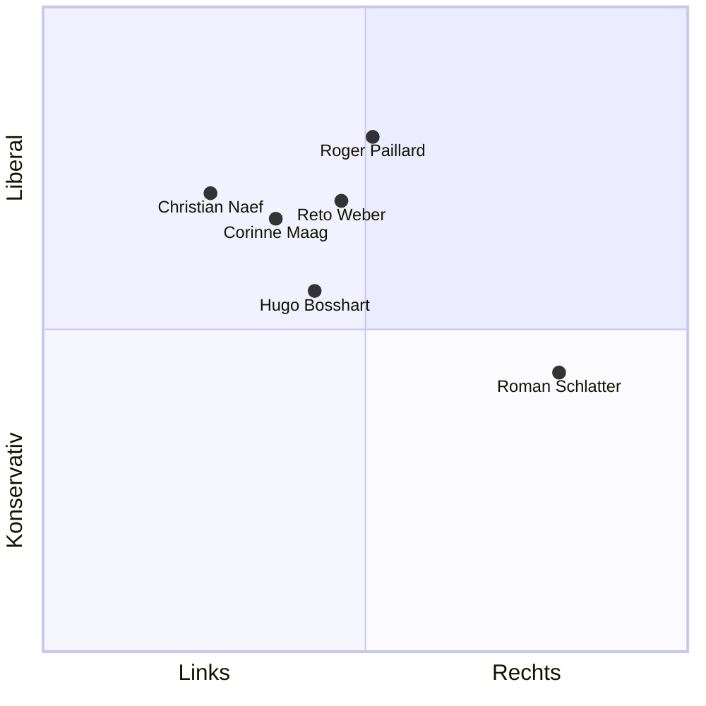
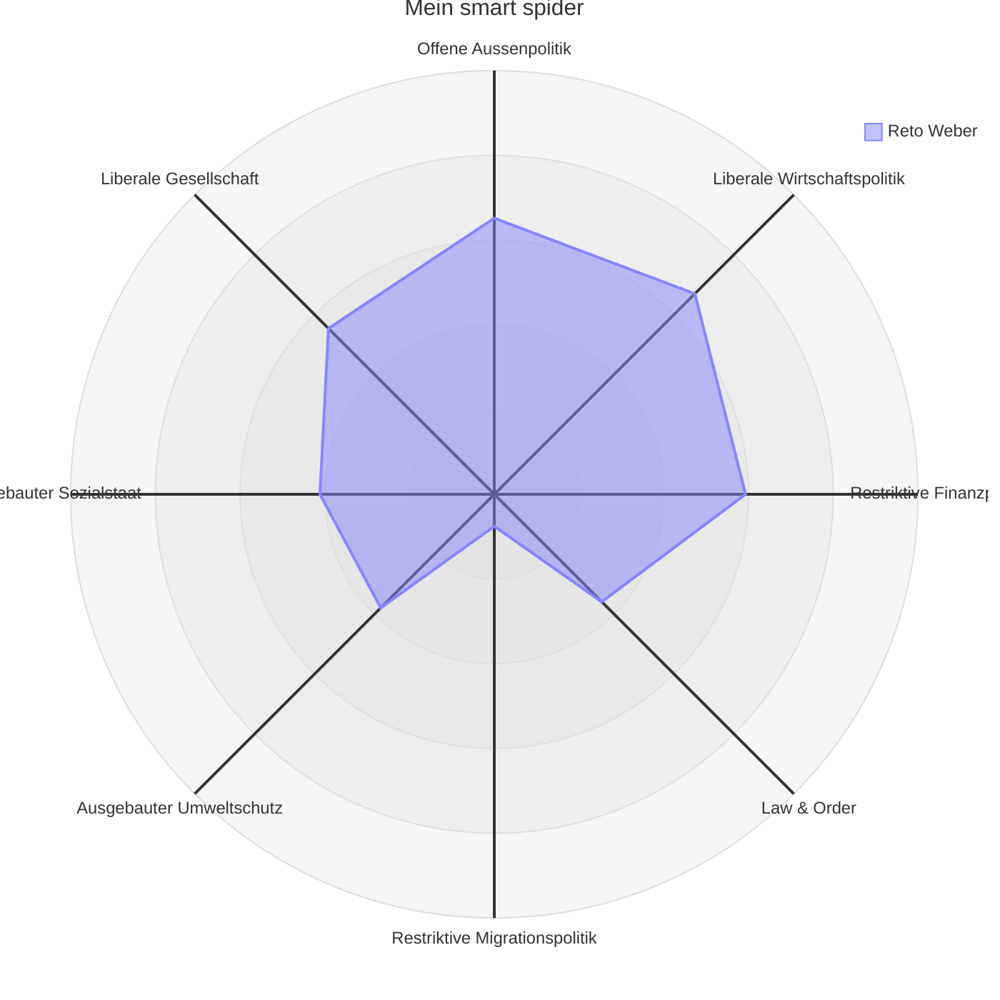

# Einwohnerrat

Seit Anfangs 2025 bin ich gewähltes Mitglied des [Einwohnerrats](https://www.beringen.ch/de/mitglieder) in Beringen. Ich vertrete die Interessen der Bevölkerung im Namen der [EVP](https://evp-sh.ch).

Zusätzlich bin ich Mitglied der [Tiefbaukomission](https://www.beringen.ch/de/tiefbau), der [Schwimmbadkomission](https://www.beringen.ch/de/schwimmbad) und im [Parteivorstand](https://www.evp-sh-2024.ch/parteivorstand) unserer kantonalen Partei.

# Smartvote
Mein politische Haltung ermittelt via [smatvote](https://smartvote.ch): 

<!-- Roman Schlatter: https://www.smartvote.ch/de/group/527/election/23_ch_nr/smartmap -->
<!-- https://www.smartvote.ch/de/group/540/election/24_sh_leg/smartmap -->

&nbsp;
{:#mermaid}

Die [Daten](https://www.smartvote.ch/de/group/540/election/24_sh_leg/smartmap) der anderen Teilnehmer. Die nicht aufgeführten Einwohnerräte und Gemeinderäte fand ich nicht online.

&nbsp;
{:#mermaid}

# Volksabstimmungen

Ich behandle hier nur Geschäfte, zu denen ich einen Bezug habe. Das sind vor allem kommunale Abstimmungen und Wahlen, aber auch kantonale oder eidgenössischee, wenn ich mich als fachkompetent dazu sehe.

## 30. November 2025

### Baukredit zum Neubau des Werkhofs Beringen an der Werkstrasse

Dies steht zur Abstimmung, weil das Bauprojekt mehr als CHF 600'000 kostet (Siehe: [Verfassung Beringen](https://www.beringen.ch/uploads/files/pdf/Beringen%20Online/Rechtsbuch/100.000%20Verfassung%20der%20Einwohnergemeinde%20Beringen.pdf) Art. 16d). Ich heisse den Neubau gut. Es entsprach dem Volkswillen, denn dieses hat dem Planungskredit zugestimmt und der geplante Werkhof entspricht dem, was damals definiert wurde. Es wird viele geben, die sagen: "Das ist ein gutes Projekt für die Beringer Bevölkerung." oder andere die sagen werden: "Das ist zu teuer." Doch für mich ist das beides irrelevant. Das Werkhofpersonal braucht dringend eine neue Bleibe. Ein alternativer Bau wird nicht günstiger, da es eine erneute Planung verursacht und der Werkhof eine Zwischenlösung braucht, die auch nicht kostenlos sein wird. Das Projekt entspricht auch dem, was beim Planungskredit bereits beschrieben wurde und dieser wurde vom Volk gutgeheissen. Obwohl wir hier das politische Mittel haben, diesen Neubau zu verhindern, sehe ich keinen Grund das zu tun. Ein Nein würde wahrscheinlich teurer kommen als ein Ja. Und ein Ja gibt dem Werkhof ein gutes neues Gebäude.

Ich erstellte wieder eine [Seite](/politik/werkhof-baukredit/) mit neutralen Fakten zur Abstimmung.

> Das Volk bewilligte den Baukredit ([Link](https://www.beringen.ch/uploads/files/pdf/Behoerde-Politik/Abstimmungen-Wahlen/2025/2025%2011%2030%20Gemeinde.pdf)). Es erstaunt mich wenig, denn der Werkhof ist einer der sichtbarsten Leistungen der Gemeinde und hat eine breite Unterstützung in derGemeinde.

## 28. September 2025

### E-ID Vortrag

{:.float-right}
Am 4. September gab ich einen öffentlichen Vortrag über die E-ID anlässlich der nationalen Abstimmung. Ich entwickelte die E-ID mit und erzählte über die technische Funktionsweise und stand für Fragen zur Verfügung. ([mehr Infos](/politik/e-id))

> Das Volk nahm die Vorlage sehr knapp an [Link](https://www.bk.admin.ch/ch/d/pore/va/20250928/index.html). In Schaffhausen war die Zustimmung signifikant kleiner [Link](https://sh.ch/CMS/get/file/f821997c-7d41-43d0-b24c-89d342385f0d).

### Referendum wegen Teilrevision der Nutzungsplanung

Das Referendum wurde ergriffen. Ich befürwortete die Vorlage des Gemeinderats und lehne das Referendum ab. Ich stellte mich zur Verfügung, auf Flyer abgedruckt zu werden. Diese Haltung stimmt mit meiner Stimme am [6. Mai 2025](#6-mai-2025) überein.

Ich bin vom Abstimmungskampf etwas enttäuscht von beiden Seiten.

- Auf der **"Pro"-Seite** zu welcher ich gehöre, wurde mein Gesicht und mein Argument abgedruckt. Ich bin jedoch der am wenigsten einflussreiche Politiker in ganz Beringen. Ich hatte gerade mal 212 Stimmen nur Thomas Widmer hatte auch nur 237 Stimmen und alle anderen hatten über doppelt so viele Stimmen; doch keiner hat sich bereit dazu erklärt, sich öffentlich für die Vorlage auszusprechen. Vielleicht wegen allfälliger Befangenheit? Doch warum sind sie dann nicht in der Einwohnerratssitzung in den Ausstand getreten?
- Auf der **"Contra"-Seite** wird jetzt damit geworben, dass das Land zu günstig umgezont wird. Aber es stand ein Vorschlag der auf dem Tisch, der mehr Geld für die Gemeinde herausholen wollte, aber dieser wurde von den jetzigen Gegnern nicht gutgeheissen.

Ich erstellte eine [Seite](/politik/zonenplanaenderung/) mit neutralen Fakten zur Abstimmung. Mehr fehlten diese Informationen in der Vergangenheit für kommunale Geschäfte. Ich versuche das auch in Zukunft zu erstellen.

> Das Volk lehnte die Zonenplanänderung ab ([Link](https://www.beringen.ch/uploads/files/pdf/Behoerde-Politik/Abstimmungen-Wahlen/2025/2025%2009%2028%20Bund%20und%20Gemeinde.pdf)), was ich schade finde. Es ist auch ein Realitätscheck für uns im Einwohnerrat. Fast alle Parteien waren dafür. Sehr viele Einwohnerräte waren dafür. Das Volk aber dagegen.

# Abstimmungen und Wahlen im Einwohnerrat {: .vote}

Hier lege ich Rechenschaft ab über was ich abgestimmt oder gewählt habe im Einwohnerrat. Die Vorlagen können auf der [Webseite](https://www.beringen.ch/de/einwohnerrat-vorlagen) der Gemeinde Beringen gefunden werden.

## 9. Dezember 2025

[Link](https://www.beringen.ch/uploads/files/pdf/Behoerde-Politik/Einwohnerrat/Beschluesse/2025/Einwohnerrat%20Beschlusse%205.%20Sitzung%20vom%209.%20Dezember%202025.pdf)

| Meine Stimme | Einwohnerrats- beschluss | Name der Vorlage |
| --- | --- | --- |
| ✓ | ✓ | Lukas Rüedlinger (SP Liste) wird zum neuen Einwohnerratspräsidenten gewählt. Beatrix Delafontainer (FDP) wird zur neuen Vizepräsidentin des Einwohnerrats gewählt und Thomas Widmer (SVP) wird zur Stellvertretung der Aktuarin gewählt. |
| ✓ | ✓ | Budget wurde angenommen und der Steuerfuss auf 91 % belassen. |
| - | ✗ | Antrag zur Steuererhöhung um 3 % wurde knapp abgelehnt. |

> Das Budget gab viel zu besprechen. Die Verschuldung wird höher und so wurde beispielsweise von Roman Schlatter ein Sparkurs vom Gemeinderat verlangt, beziehungsweise eine mangelnde Sparbereitschaft kritisiert. Von Lukas Rüedlinger wurde beantragt, dass der Steuerfuss erhöht wird, um den Schulden entgegenzuwirken. Argumente dafür waren: Der Kanton senkte die Steuern um 3 % somit wäre der Steuerfuss netto gleichbleibend; wir haben die Verantwortung für die Gemeinde und sollten Massnahmen ergreifen. Gegenargumente sind: Die Schulden seien nicht soo schlimm. Und Steuernerhöhen ohne Sparwille sei auch der falsche Weg. Ich konnte mich nicht zu einer klaren Meinung durchringen und enthielt mich.

## 23. September 2025

[Link](https://www.beringen.ch/uploads/files/pdf/Behoerde-Politik/Einwohnerrat/Beschluesse/2025/Einwohnerrat%20Beschlusse%204.%20Sitzung%20vom%2023.%20September%202025.pdf)

| Meine Stimme | Einwohnerrats- beschluss | Name der Vorlage |
|---|---|---|
| ✓ | ✓ | Baukredit Neubau Werkhof an der Werkstrasse |
| ✓ | ✓ | Gesamtkredit für Umsetzung Beleuchtungskonzept (öffentliche Beleuchtung) |
| ✗ | ✗ | Verschidenes: Antrag die Einwohnerratssitzung von 20:00 auf 19:30 zu verschieben |

> Der Neubau des Werkhofs verursachte lange Diskussionen. Es wurde vor allem bemängelt, dass der Bau zu teuer sei und viele Fahrzeuge draussen stehen bleiben könnten. Meine Haltung war von Beginn, dass dies zu spät sei. Wir sind nicht in der Planungsphase. Es wurde gesagt, es werde 5.3 Mio kosten (± 30%). Jetzt kostet es 4.9 Mio (± 10%). Aus meiner Sicht hat der Gemeinderat alles genauso umgesetzt wie angekündigt und aufgetragen. Zusätzlich hat das Volk "Ja" zum Planungskredit gesagt und ich fände es bevormundend zu einem Projekt "Nein" zu sagen, das genau den Spezifikationen entspricht. Die Vorlage unterliegt dem obligatorischen Referendum, weil sie zu teuer ist.

## 1. Juli 2025

[Link](https://www.beringen.ch/uploads/files/pdf/Behoerde-Politik/Einwohnerrat/Beschluesse/2025/Einwohnerrat%20Beschlusse%203.%20Sitzung%20vom%201.%20Juli%202025.pdf)

| Meine Stimme | Einwohnerrats- beschluss | Name der Vorlage |
|---|---|---|
| ✓ | ✓ | Jahresrechnung 2024 der Einwohnergemeinde Beringen |
| ✓ | ✓ | Landverkauf der Parzelle GB Nr. 1848 in Beringen. Die Parzelle GB Nr. 1848 entlang der Schaffhauserstrasse wird dem Migros-Genossenschafts-Bund fürtotal CHF 305'760.00 verkauft. Sollte auch noch ein Mehrzweckstreifen entlang der Schaffhauserstrasse eingeplant und ein Teil der Parzelle GB Nr. 1848 an den Kanton Schaffhausen abgetreten werden, ist die an den Migros-Genossenschafts-Bund zu veräussernde Parzelle entsprechend zu reduzieren. Der Kaufpreis beträgt auch in diesem Fall CHF 490.00 pro m2. Die anfallenden Kosten des Grundbuchamtes gehen in jedem Fall zu Lasten der Käuferin. |

> Ich fand es schön, dass ein Vorschlag des Einwohnerrats innert einem halben Jahr zu einer Vorlage wurde. Die neue Verkehrsführung bei der Migros wurde nämlich in der Einwohnerratssitzung im Dezember eingebracht und jetzt in die Wege geleitet.

---

## 6. Mai 2025

[Link](https://www.beringen.ch/uploads/files/pdf/Behoerde-Politik/Einwohnerrat/Beschluesse/2025/Einwohnerrat%20Beschlusse%202.%20Sitzung%20vom%206.%20Mai%202025.pdf)

| Meine Stimme | Einwohnerrats- beschluss | Name der Vorlage |
|---|---|---|
| ✓ | ✗ | Antrag von [Michael Bizic](https://www.garbatec.ch/garbatec/team) zur Vorlage über Teilrevision der der Nutzungsplanung: Die Vorlage an den Gemeinderat zurückzuweisen, mit der Begründung, Punkt 5 neu zu verhandeln. Hierbei geht es um die Entschädigungen an die Gemeinde Beringen. Der neue Vorschlag oder Vorgabe wäre 40 Rappen pro Kubikmeter Kies, welcher die Grube verlässt, und 30 Rappen pro Kubikmeter Füllmaterial, welches wieder hineinkommt. |
| ✓ | ✓ | Vorlage über die Teilrevision der Nutzungsplanung bezüglich der Zonenplanänderung im Gebiet Hooloo/Hinderi Laufferstaag und die Änderung der Bau- und Nutzungsordnung. |

> Der Antrag von [Michael Bizic](https://www.garbatec.ch/garbatec/team) fand ich unterstützenswert und hätte ihn der Vorlage vorgezogen. Er wurde aber mit 5 zu 4 bei 1 Enthaltung abgelehnt. Ich war aber eher für die originale Vorlage als gar nichts.

---

## 14. Januar 2025

[Link](https://www.beringen.ch/uploads/files/pdf/Behoerde-Politik/Einwohnerrat/Beschluesse/2025/Einwohnerrat%20Beschlusse%201.%20Sitzung%20vom%2014.%20Januar%202025.pdf)

| Meine Stimme | Einwohnerrats- beschluss | Name der Vorlage |
|---|---|---|
| - | ✓ | Gewählt als Stimmenzähler. |
| ✓ | ✓ | In unterschiedlichen Wahlen wählte ich die vorgeschlagenen Kandidatinnen und Kandidaten. |
| ✓ | ✓ | Vorlage zur Anpassung des Schulleitungspensums als Folge der Vorgaben zur flächendeckenden Einführung von geleiteten Schulen im Kanton Schaffhausen |
| ✓ | ✓ | Abrechnung über die Neugestaltung der Kreuzung Trasadingerstrasse H13 – Haardaublick (Bömmliacker Ost) Beringen über brutto CHF 295'472.95 |
| ✓ | ✓ | Abrechnung für die Beschaffung eines neuen Gemeindefahrzeuges für den Gebäudeunterhalt über brutto CHF 114‘393.80 |

> In dieser ersten Sitzung war ich nervös. Auch wenn Stimmen zählen nicht schwierig ist, war es mit der Nervosität eine kleine Herausforderung. Bei der Abrechnung bezüglich "Beschaffung eines neuen Gemeindefahrzeugs" fragte ich nach, warum das alte so günstig verkauft wurde. Hugo Bosshart (Tiefbaureferent) beantwortete die Frage im Moment zufriedenstellend. Im Nachhinein hätte ich mehr nachhaken sollen, der Preis war wirklich zu tief.

---
