# Finanzen der Gemeinde Beringen

Ich erstellte einige Graphen aus den Rechnungen und den Budgets der Gemeinde Beringen. Eventuell machte ich ein paar Fehler. Wenn dir einer auffällt, lass es mich wissen.

## Ausgaben pro Einwohner:in in Beringen

&nbsp;
{:#mermaid}

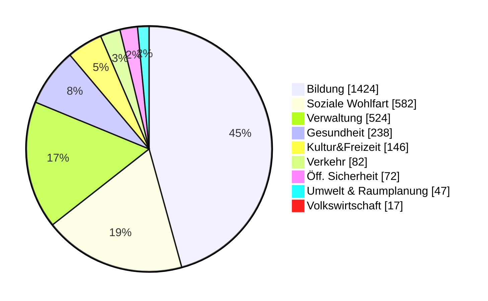

Beringen nimmt pro Einwohner:in CHF 3010 pro Jahr ein und gibt etwa genau so viel aus (CHF 3133). Diese Daten sind wenig aussagekräftig. Wir können das aber mit einer Nachbargemeinde vergleichen:

## Vergleich mit Neunkirch

&nbsp;
{:#mermaid}

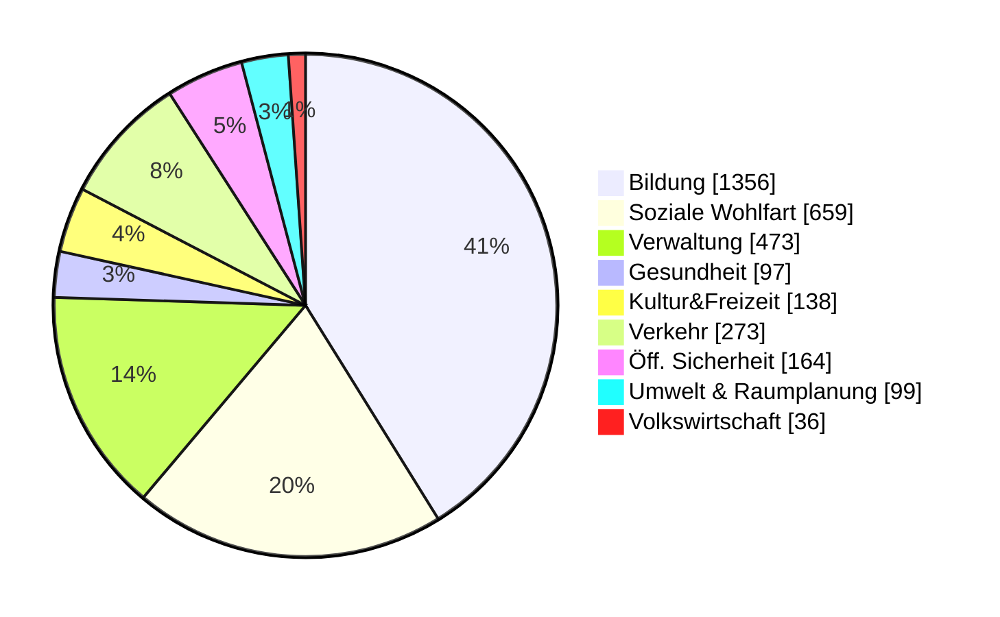
Neunkirch nimmt mit CHF 3213 sogar etwas mehr ein pro Person. Es zeigt sich, dass in Neunkirch mehr als dreimal mehr Geld für Verkehr ausgegeben wird. Gesundheit sind sie jedoch viel günstiger unterwegs. Für die Öffentliche Sicherheit, Umwelt & Raumplanung und die Volkswirtschaft gibt Neunkrich doppelt so viel aus wie Beringen. Solche Vergleiche erlauben (beispielsweise als Geschäftsprüfungskomissionsmitglied) zu beurteilen, wo genauer nachgeforscht werden sollte.

## Ausgaben pro Einwohner:in 2025

Diese aktuelle Aufteilung steht getrennt vom obigen Vergleich mit Neunkirch. Die Ausgabenbereiche ergeben zusammen rund CHF 3’261 pro Person. «Finanzen» sind in der Quelle Einnahmen (CHF 3’393 pro Person) und deshalb nicht im Kreisdiagramm enthalten; der ausgewiesene Überschuss beträgt CHF 131 pro Person.

&nbsp;
{:#mermaid}

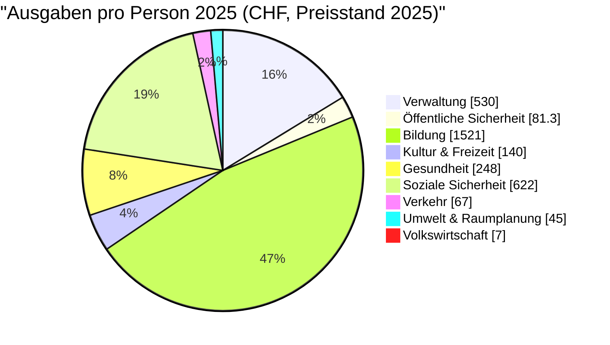

# Entwicklung

Ebenso ist die Entwicklung dieser Zahlen wichtig. Sind die Zahlen ansteigend oder sinkend? So wird beispielsweise wieder und wieder behauptet, die Verschuldung von Beringen sei zu hoch, aber die Zahlen belegen das nicht. Die Schulden sind stabil zwischen 34 und 39 Millionen oder ca. CHF 7000 pro Einwohner:in.

## Fremdkapital

Für Fremdkapital liegen Werte für 2020 bis 2025 vor.

&nbsp;
{:#mermaid}

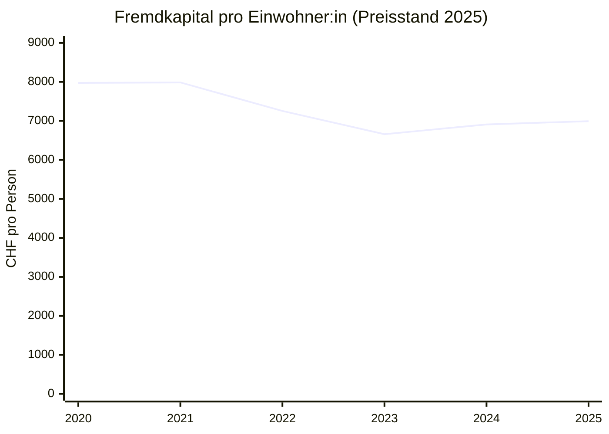

## Negative Entwicklungen

Die Ausgaben pro Person unterscheiden sich je nach Aufgabenbereich. In den Rechnungsjahren liegen Verwaltung und öffentliche Sicherheit 2025 über ihren Werten von 2012; die Gesundheitsausgaben sind gegenüber 2020 gestiegen.

&nbsp;
{:#mermaid}

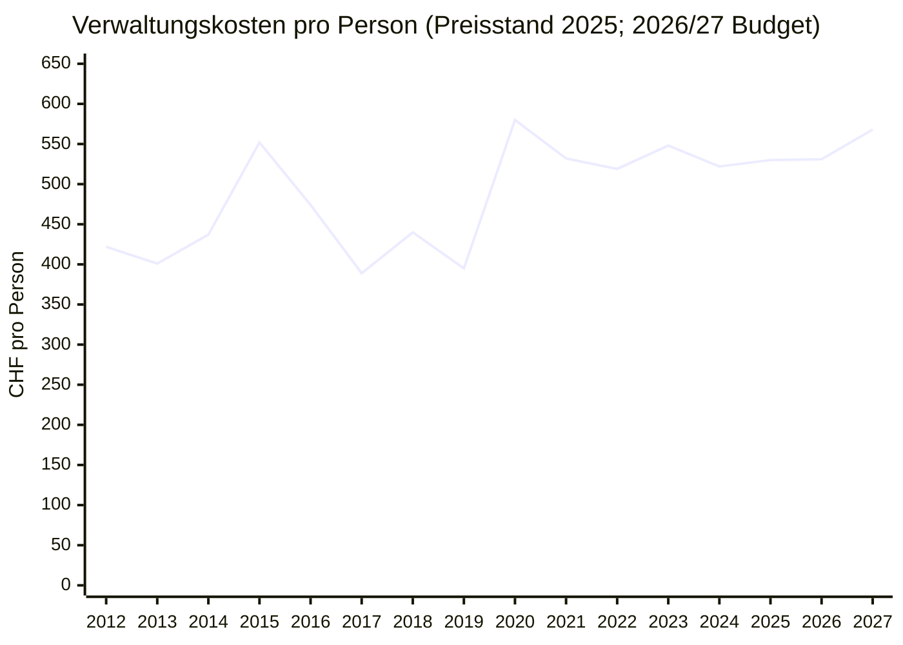

&nbsp;
{:#mermaid}

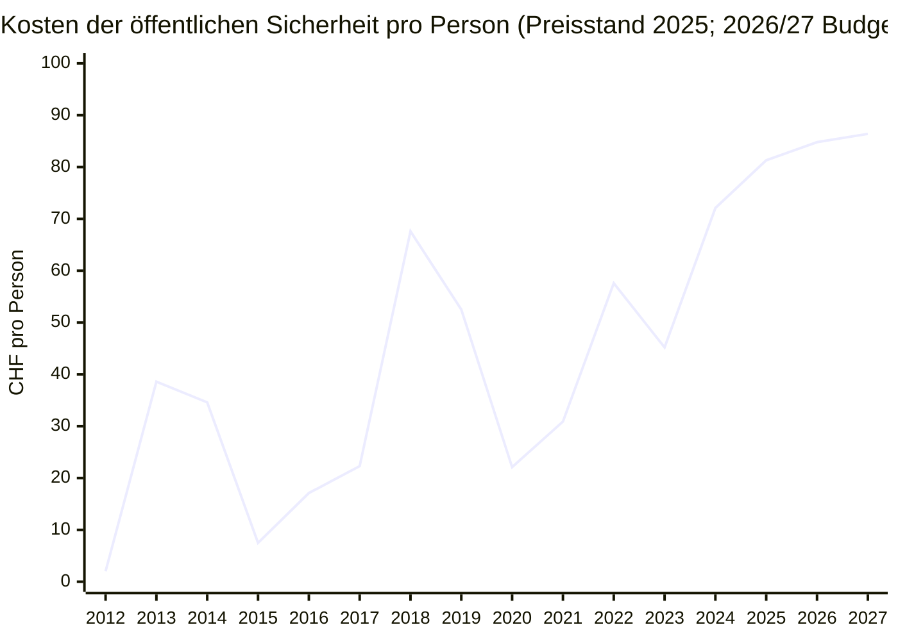

&nbsp;
{:#mermaid}

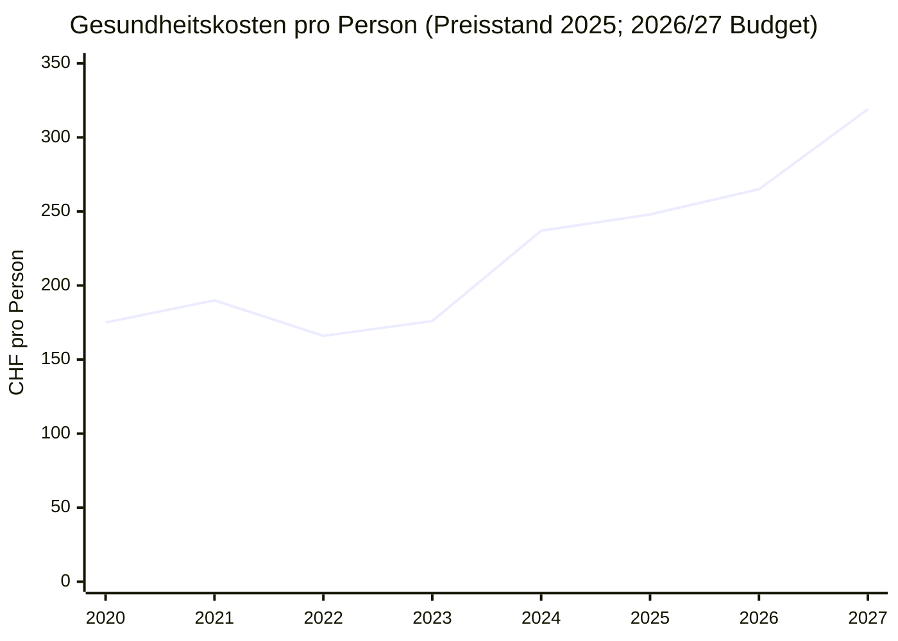
Die Reihe beginnt 2020, weil es dort einen Systemwechsel gab und frühere Kosten deshalb nicht vergleichbar sind.

## Positive Entwicklungen

Die Budgetwerte 2027 für Verkehr und Umwelt liegen unter ihren früheren Spitzenwerten. Sie sind Planwerte und nicht mit abgeschlossenen Rechnungen gleichzusetzen.

&nbsp;
{:#mermaid}

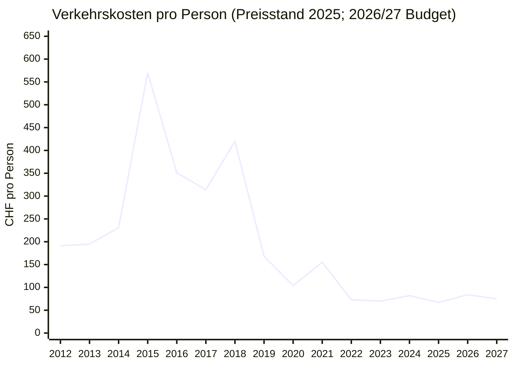

&nbsp;
{:#mermaid}

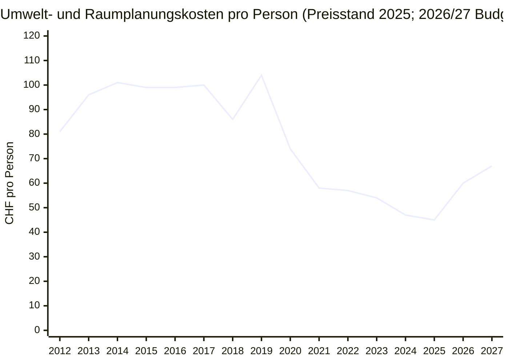

# Bilanz pro Einwohner:in

Die Bilanzwerte liegen für 2020 bis 2025 vor. Alle Werte in den folgenden Diagrammen sind CHF pro Person mit Preisstand 2025.

## Nettoverschuldung

&nbsp;
{:#mermaid}

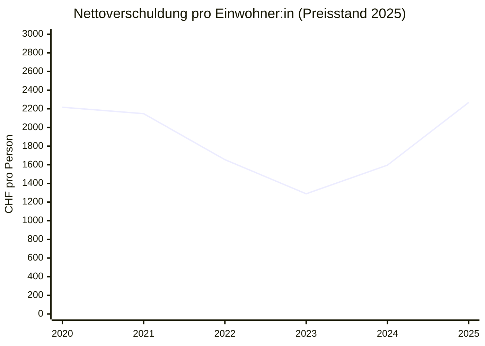

## Aktiven pro Einwohner:in

Die Linien zeigen in dieser Reihenfolge: Aktiven, Finanzvermögen und Verwaltungsvermögen.

&nbsp;
{:#mermaid}

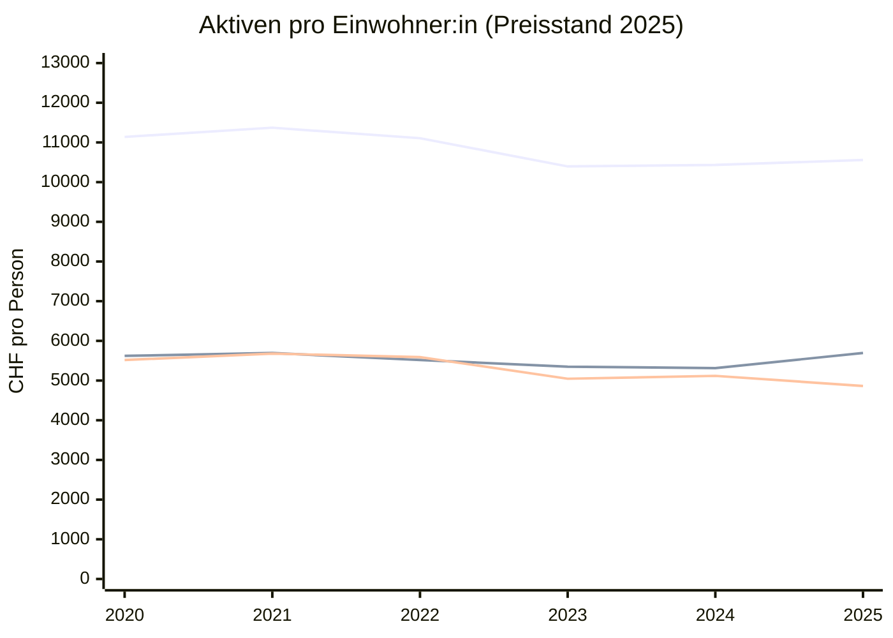

## Passiven pro Einwohner:in

Die Linien zeigen in dieser Reihenfolge: Passiven, Fremdkapital und Eigenkapital.

&nbsp;
{:#mermaid}

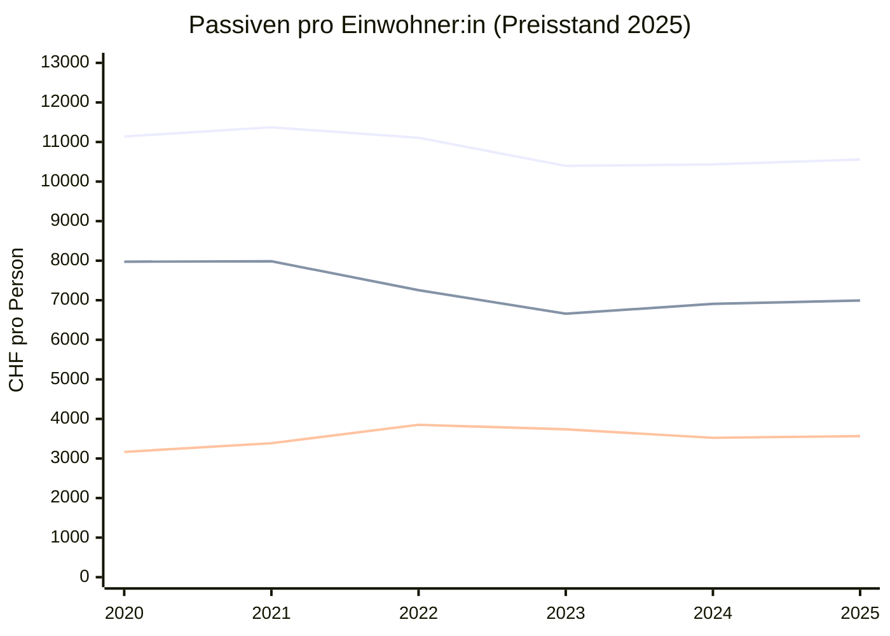

Die Aktiven und Passiven stimmen in der Quelle für alle dargestellten Jahre überein. Wegen Rundungen können Aktiven und Passiven um wenige Franken von der Summe ihrer Unterpositionen abweichen.

# Schulstatistik

Die Kosten pro Schüler:in und pro Klasse sind in den folgenden Diagrammen in CHF mit Preisstand 2025 dargestellt.

## Kosten pro Schüler:in

&nbsp;
{:#mermaid}

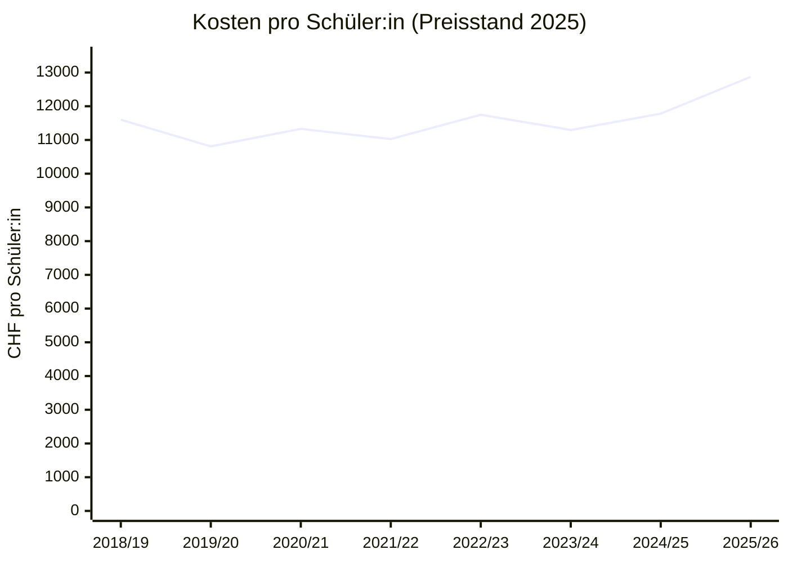

## Kosten pro Klasse

&nbsp;
{:#mermaid}

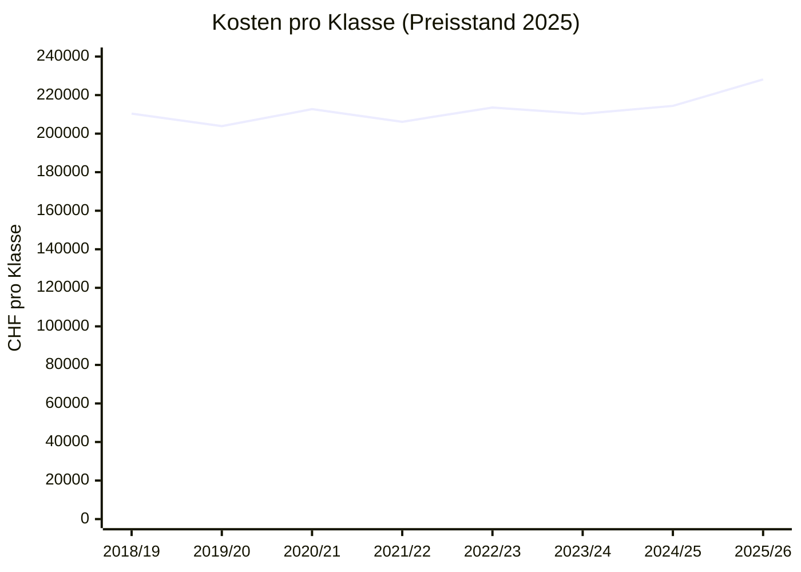

# Stimmt das Budget?

Das Budget muss jedes Jahr erstellt werden. Es soll Orientierung liefern, wie die Ausgaben und Einnahmen im kommenden Jahr sein werden. Doch dieses eigentlich analytische Instrument ist immer wieder ein Werkzeug, um politische Macht auszuüben, und wird verwendet, um eine Geschichte zu erzählen, anstatt einen realistischen Blick in die Zukunft zu werfen. So betrachten wir hier die Diskrepanz zwischen Budget und Rechnung. Es sei angemerkt, dass im Jahr 2021 eine unerwartet grosse Steuerzahlung aus der Wirtschaft eintraf. Es gibt jedes Jahr ein paar Dinge, die nicht einkalkuliert wurden. Doch im Durchschnitt gleichen sie sich wieder aus.

Ich konnte die Budgets und Rechnungen bis ins Jahr 2020 vergleichen. Für die früheren Jahre stand mir das Budget nicht zur Verfügung.
{:#budget}

Die folgende Tabelle verwendet nominale CHF des jeweiligen Jahres. Anders als die Pro-Kopf-Grafiken ist sie nicht auf Preisstand 2025 umgerechnet.

| Jahr | Rechnung (CHF) | Budget (CHF) | Differenz (CHF) |
|------|----------------|--------------|-----------------|
| 2018 | 49,410         | 327,000      | -277,590        |
| 2019 | -350,584       | -218,000     | -132,584        |
| 2020 | -230,101       | -328,630     | 98,529          |
| 2021 | 1,066,430      | -205,694     | 1,272,124       |
| 2022 | 124,426        | -68,785      | 193,211         |
| 2023 | 151,917        | -197,471     | 349,388         |
| 2024 | -647,740       | -784,180     | 136,440         |
| 2025 | 708,995        | -540,095     | 1,249,090       |

Die Rechnung war 2019 das letzte mal schlechter als das Budget. Im Durchschnitt ist das Budget CHF 275'000 zu pessimistisch und im Median CHF 218'000. Diese Abweichung scheint systematisch zu sein. So wird pessimistisch budgetiert, um Sparmassnahmen zu rechtfertigen oder zumindest Argumente gegen neue Ausgaben zu haben. Auch kann sich der Gemeinderat selbst immer wieder ein Kränzchen binden, da er ja besser abgeschlossen hat als budgetiert. Ich möchte mich ja nicht über eine gute Rechnung beklagen, aber das ist aus meiner Sicht etwas Augenwischerei und ein Missbrauch dieses Instruments. Ich verurteile es nur bedingt, da Budgets öfters zu den genannten Zwecken missbraucht werden. Aber dennoch möchte ich es hier festhalten.
