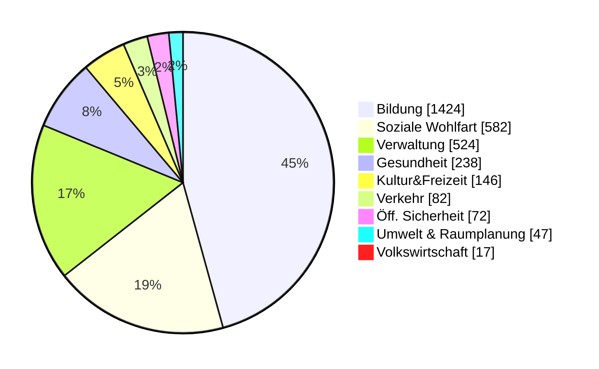
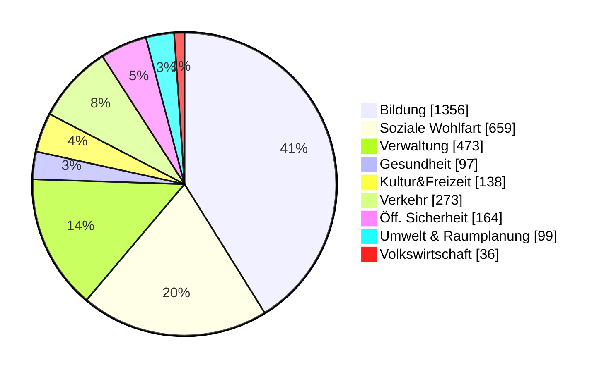
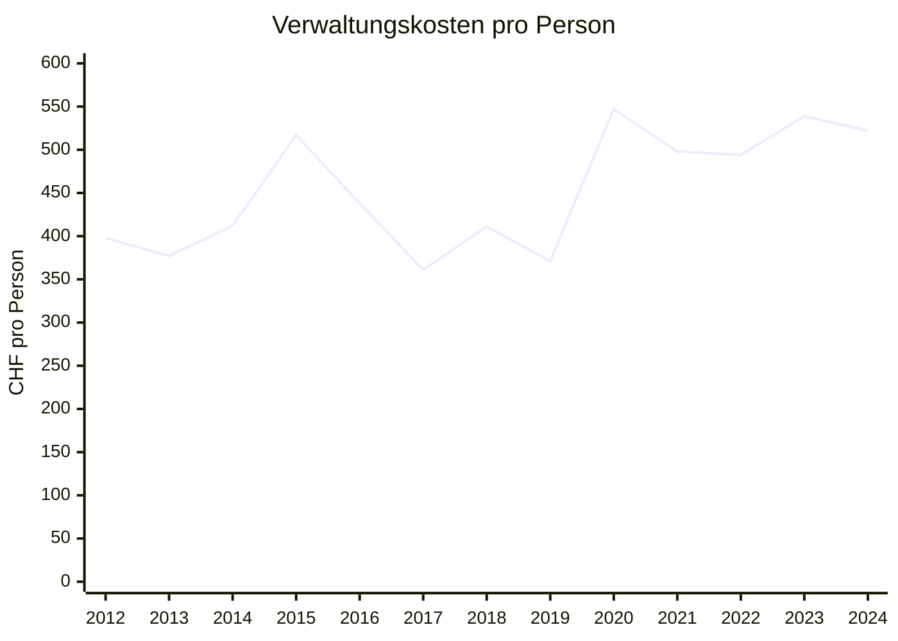
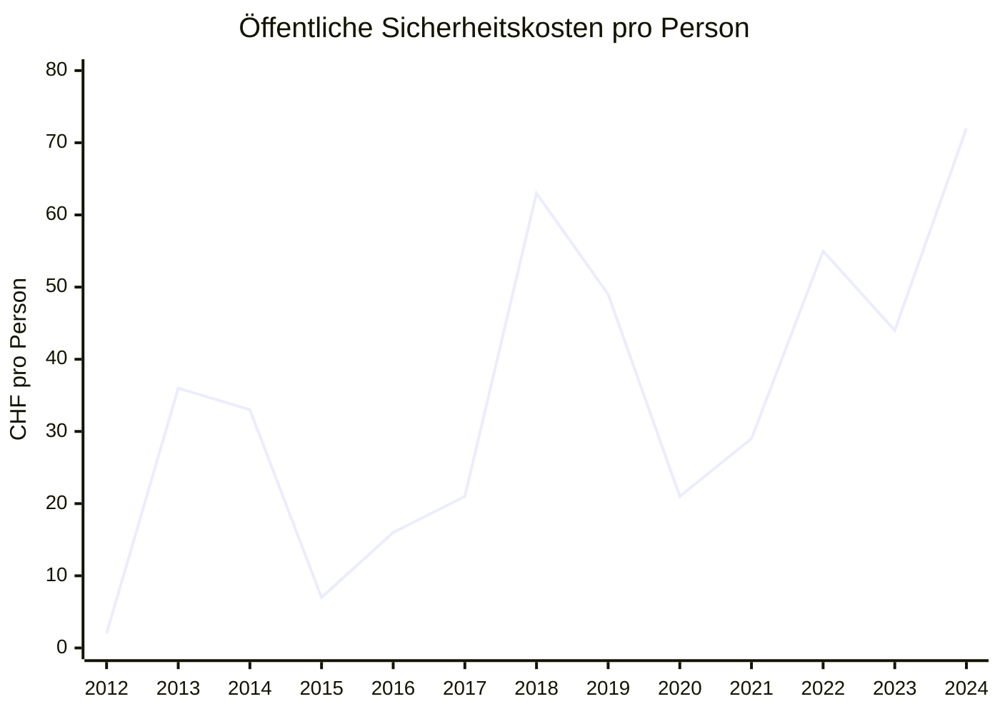
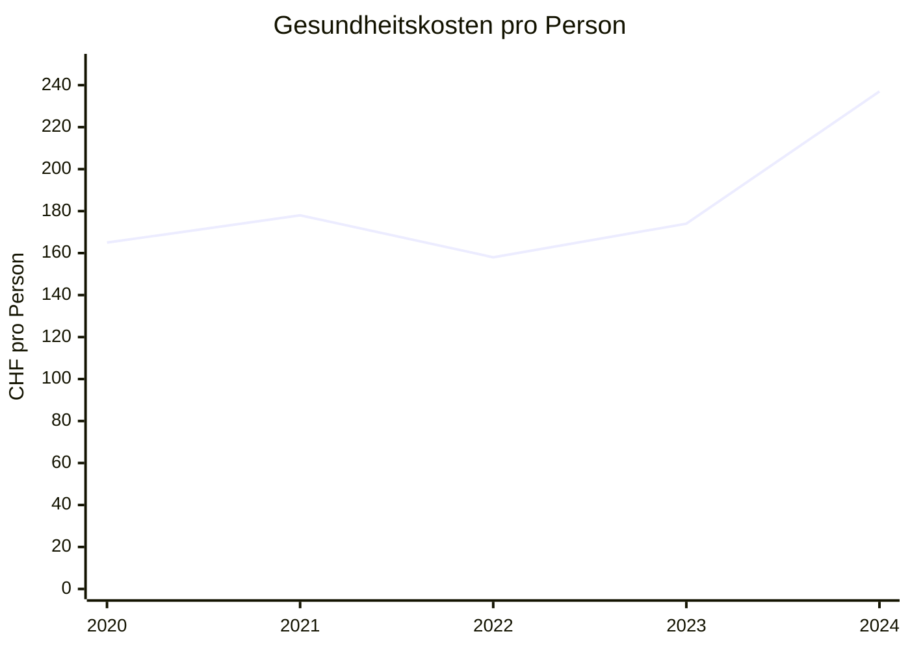
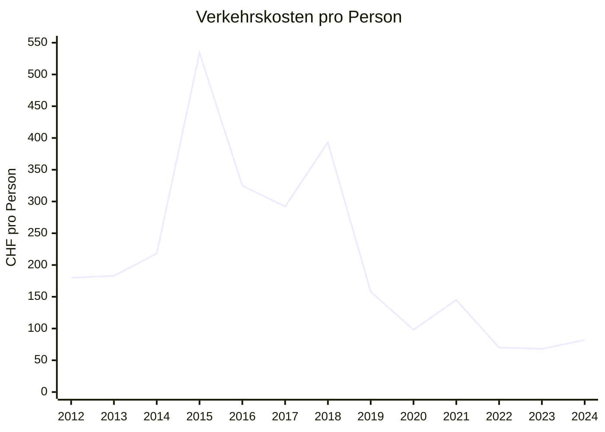
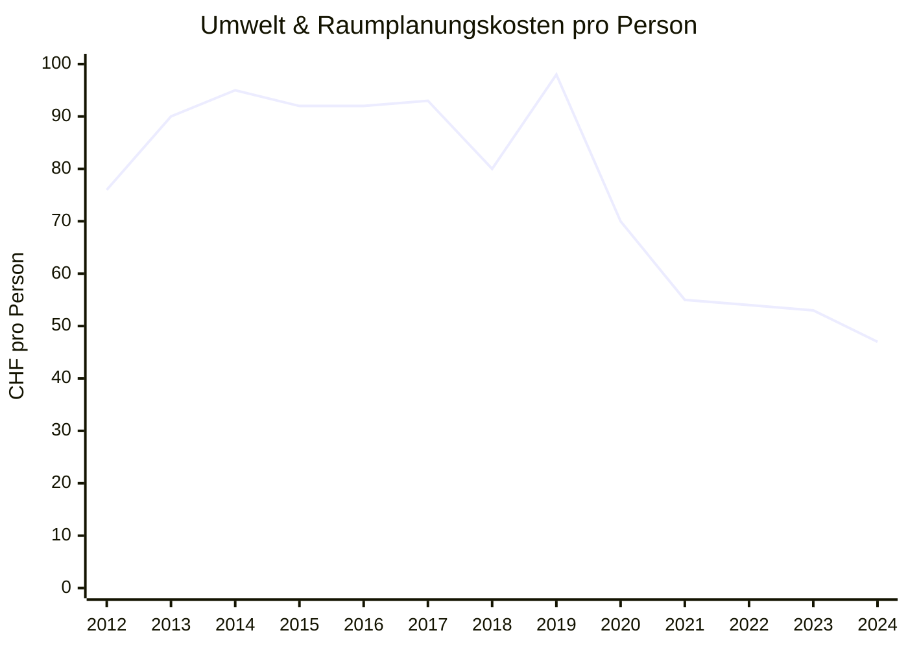

# Finances of the municipality of Beringen

I created some graphs from the bills and the budgets of the municipality of Beringen. Maybe I made some mistakes. If you notice, let me know.

## Expenditure per inhabitant:in Beringen

&nbsp;
{:#mermaid}



Per inhabitant:in CHF 3010 per year and spends about as much (CHF 3133). These data are not meaningful. But we can compare this with a neighboring community:

## Comparison with Neunkirch

&nbsp;
{:#mermaid}


With CHF 3213, Neunkirch even takes a little more one per person. It shows that more than three times more money is spent on traffic in Neunkirch. However, they are much cheaper on the go. For public safety, environment & spatial planning and the economy, Neunkrich has twice as much as Beringen. Such comparisons allow (for example as a business audit committee member) to assess where more detailed investigations should be carried out.

# Development

The development of these figures is also important. Are the numbers rising or falling? For example, it is claimed again and again that the debt of perpetrators is too high, but the figures do not prove that. Debts are stable between 34 and 39 million or approx. CHF 7000 per inhabitant:in.

&nbsp;
{:#mermaid}

```mermaid
xychart
title "Fremdkapital"
x-axis [2020, 2021, 2022, 2023, 2024]
y-axis "Millionen CHF" 0 --> 40
line [38.010, 38.342, 35.781, 34.232, 37.158]
```

## Negative developments

Some significant developments are expenditure per person, based on the categories. The following are increasing and it may be useful to keep an eye on them.

&nbsp;
{:#mermaid}



&nbsp;
{:#mermaid}



&nbsp;
{:#mermaid}


I chose the start here at 2020 because there was a system change and the costs are not comparable.

## Positive developments

On the other hand, there are trends that are pleasing.

&nbsp;
{:#mermaid}



&nbsp;
{:#mermaid}



# Is the budget right?

The budget must be created every year. It should provide guidance on how spending and revenue will be in the coming year. But this actually analytical instrument is always a tool to exercise political power, and is used to tell a story instead of taking a realistic look into the future. This is how we look at the discrepancy between budget and bill. It should be noted that in 2021 an unexpectedly large tax payment came from the economy. There are a few things each year that were not calculated. On average, however, they are equal.

I was able to compare the budgets and invoices by 2020. The budget was not available to me for the previous years.
{:#budget}

| Year | Account (CHF) | Budget (CHF) | Difference (CHF) |
|------|----------------|--------------|-----------------|
| 2020 | -230,101       | -328,630     | -98,529         |
| 2021 | 1,066,430      | -205,694     | -1,272,124      |
| 2022 | 124,426        | -68,785      | -193,211        |
| 2023 | 151,917        | -197,471     | -349,388        |
| 2024 | -647,740       | -784,180     | -136,440        |

The bill has never been worse than the budget. On average, the budget is CHF 409'000 too pessimistic and in the Median CHF 193'000. This deviation seems to be systematic. This is a pessimistic budget to justify austerity measures or at least to have arguments against new expenditure. The municipal council itself can also bind a wreath again and again, as it has better concluded than budgeted. Just last year (2024) would have been much more positive, this unexpected tax repayment would not have happened. I don't want to complain about a good bill, but I think it's something eyewitness and abuse of this instrument. I just condemn it because budgets are abused everywhere for the purposes mentioned. But I still want to hold it here.
