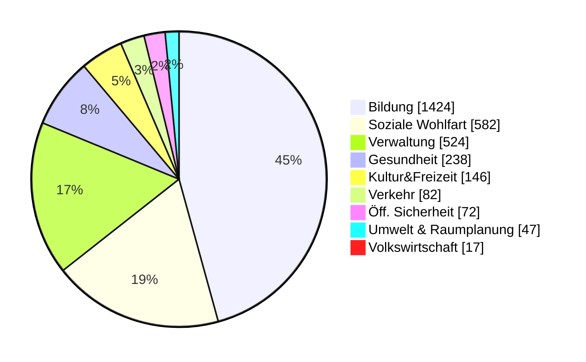
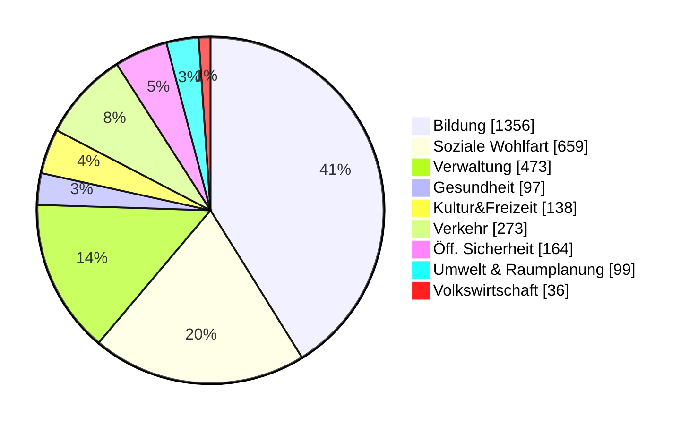
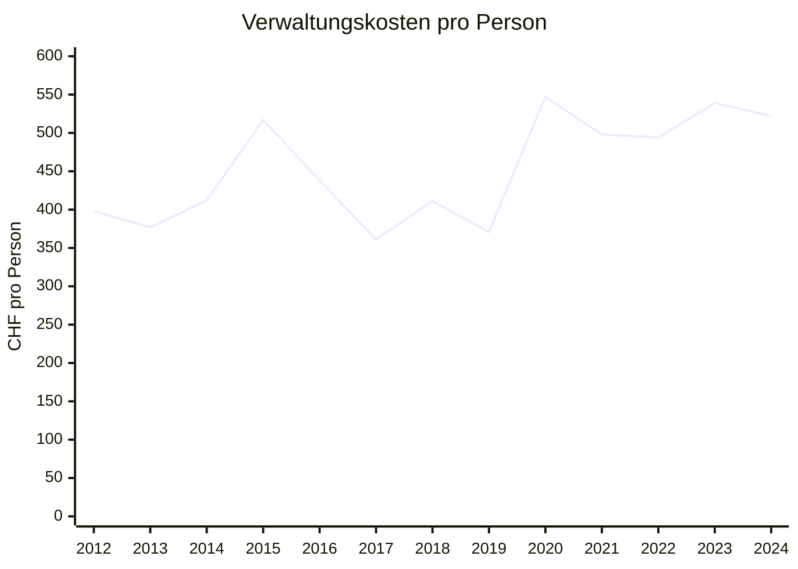
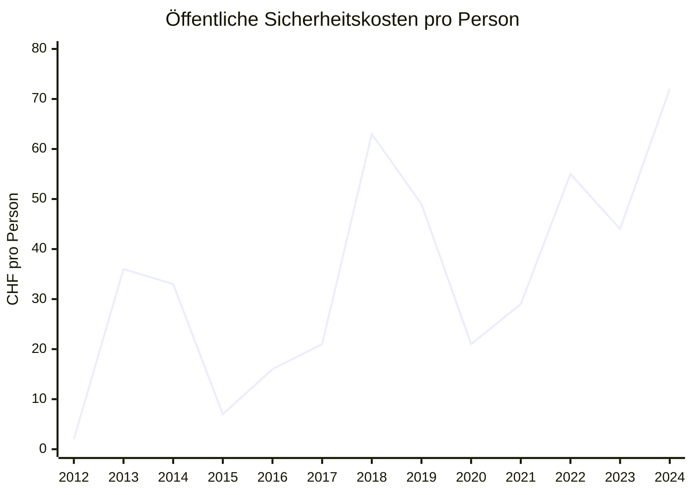
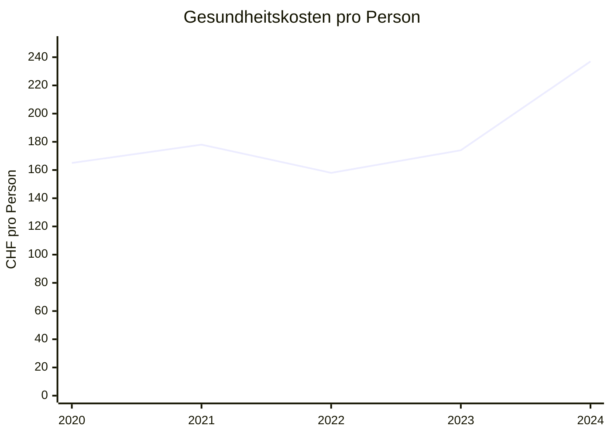
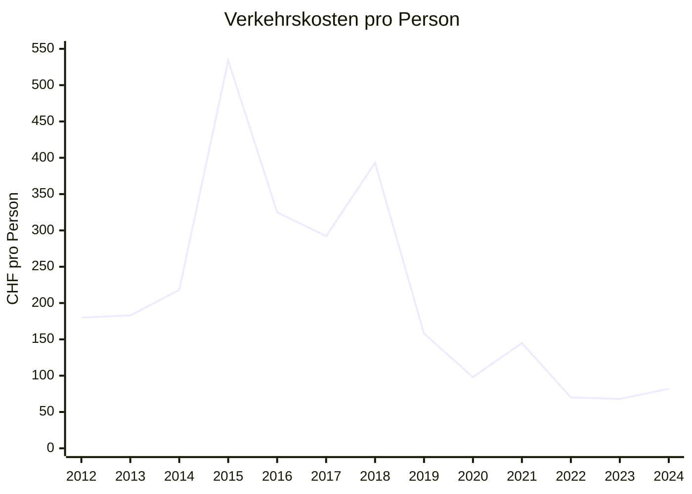
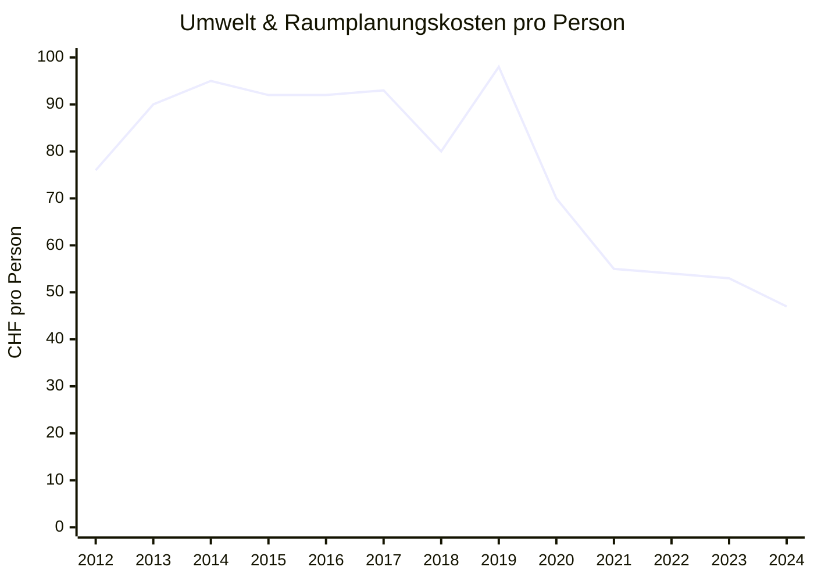

# Finances of the municipality of Beringen

I created a few charts based on the municipality of Beringen’s financial statements and budgets. I may have made mistakes — if you spot one, please let me know.

## Per-capita spending in Beringen

&nbsp;
{:#mermaid}



Beringen takes in CHF 3,010 per resident per year and spends roughly the same amount (CHF 3,133). On their own, these numbers don’t say much — but we can compare them with a neighboring municipality:

## Comparison with Neunkirch

&nbsp;
{:#mermaid}


With CHF 3,213, Neunkirch takes in slightly more per person. It’s striking that Neunkirch spends more than three times as much on transport. On the other hand, it spends far less on health. For public safety, environment & spatial planning, and the local economy, Neunkirch spends about twice as much as Beringen. Comparisons like this can help (for example, as a member of an audit committee) identify where it might be worth taking a closer look.

# Development

The trend over time matters as well: are the figures rising or falling? For example, it is repeatedly claimed that Beringen’s debt is too high, but the numbers don’t support that. Debt has been stable between CHF 34 and 39 million — about CHF 7,000 per resident.

&nbsp;
{:#mermaid}

```mermaid
xychart
title "Fremdkapital"
x-axis [2020, 2021, 2022, 2023, 2024]
y-axis "Millionen CHF" 0 --> 40
line [38.010, 38.342, 35.781, 34.232, 37.158]
```

## Negative developments

Some notable developments show up in per-capita spending by category. The following are increasing, so it may be worth monitoring them more closely.

&nbsp;
{:#mermaid}



&nbsp;
{:#mermaid}



&nbsp;
{:#mermaid}


I start this chart in 2020 because there was a system change, so earlier numbers aren’t comparable.

## Positive developments

On the other hand, there are trends that are pleasing.

&nbsp;
{:#mermaid}



&nbsp;
{:#mermaid}



# Is the budget realistic?

The budget is prepared every year. In principle, it should be an analytical tool: a best-effort estimate of spending and revenue for the coming year. In practice, budgets are also used politically — to justify austerity measures or to frame a narrative. Here I look at the gap between the budget and the actual result. Note that in 2021 there was an unexpectedly large one-off tax payment from the business sector. Every year has a few items that aren’t anticipated, but over time they tend to average out.

I was able to compare budgets and actuals back to 2020. I didn’t have budget data for earlier years.
{:#budget}

| Year | Actual (CHF) | Budget (CHF) | Difference (CHF) |
|------|----------------|--------------|-----------------|
| 2020 | -230,101       | -328,630     | -98,529         |
| 2021 | 1,066,430      | -205,694     | -1,272,124      |
| 2022 | 124,426        | -68,785      | -193,211        |
| 2023 | 151,917        | -197,471     | -349,388        |
| 2024 | -647,740       | -784,180     | -136,440        |

The actual result has never been worse than the budget. On average, the budget is CHF 409,000 too pessimistic, and the median gap is CHF 193,000. That looks systematic. A conservative budget can be used to justify cuts, or at least to argue against new spending. It can also make it easier for the municipal council to claim success (“we did better than budgeted”). In 2024, the result would have been even more positive if an unexpected tax repayment hadn’t occurred. I’m not complaining about a good result — but in my view this can amount to spin, and to misusing the budget as an instrument.
