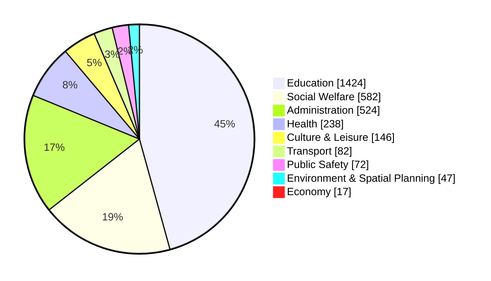
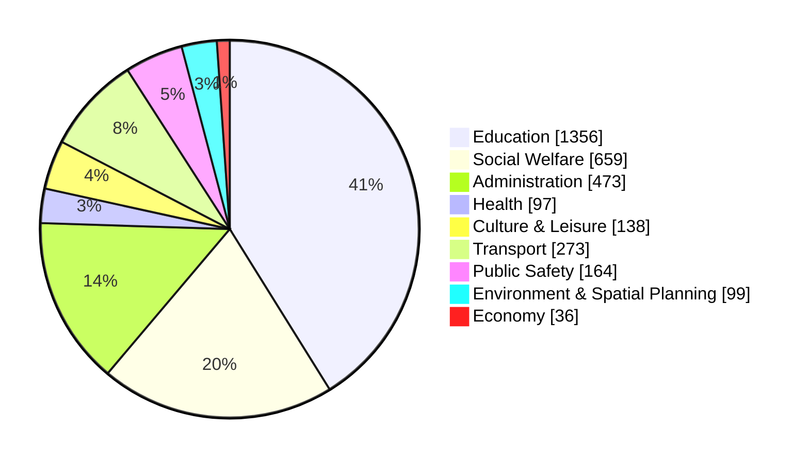
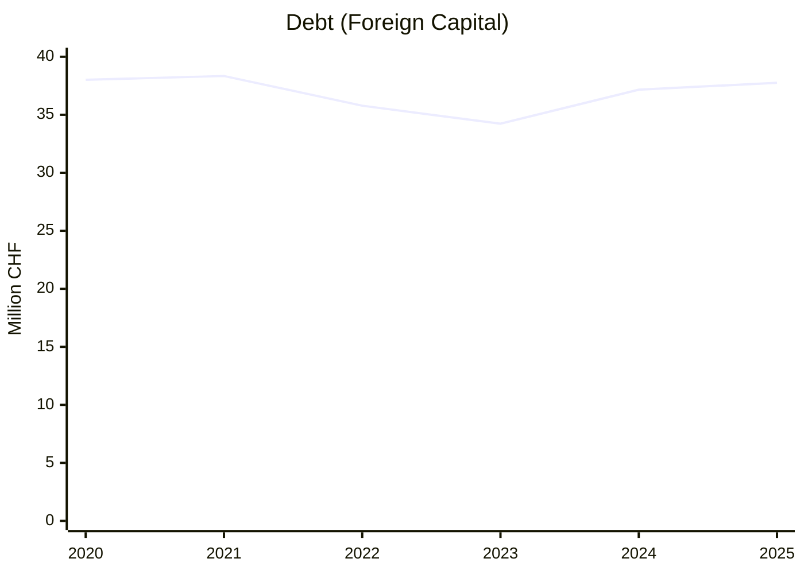
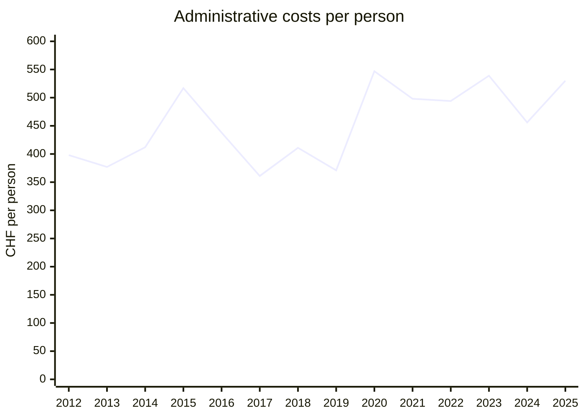
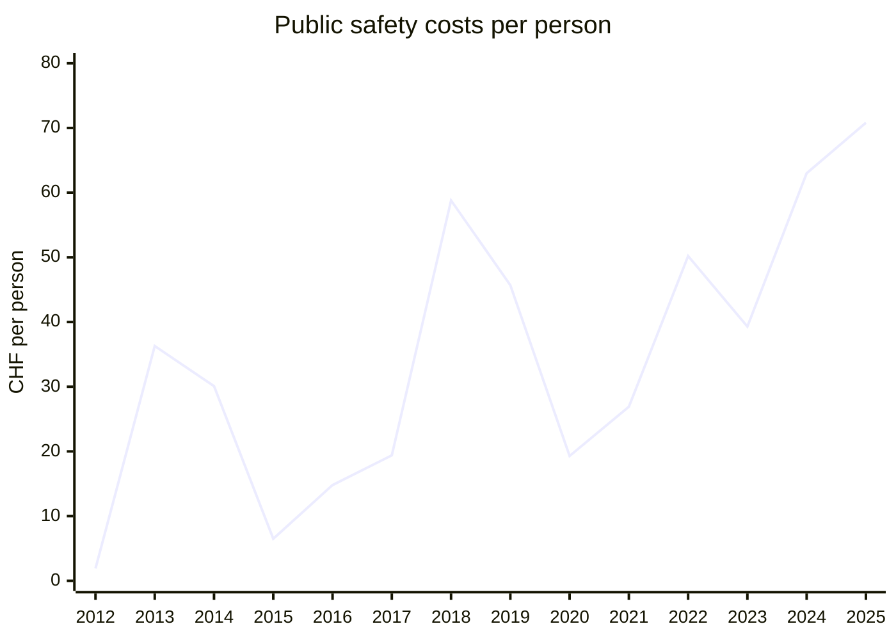
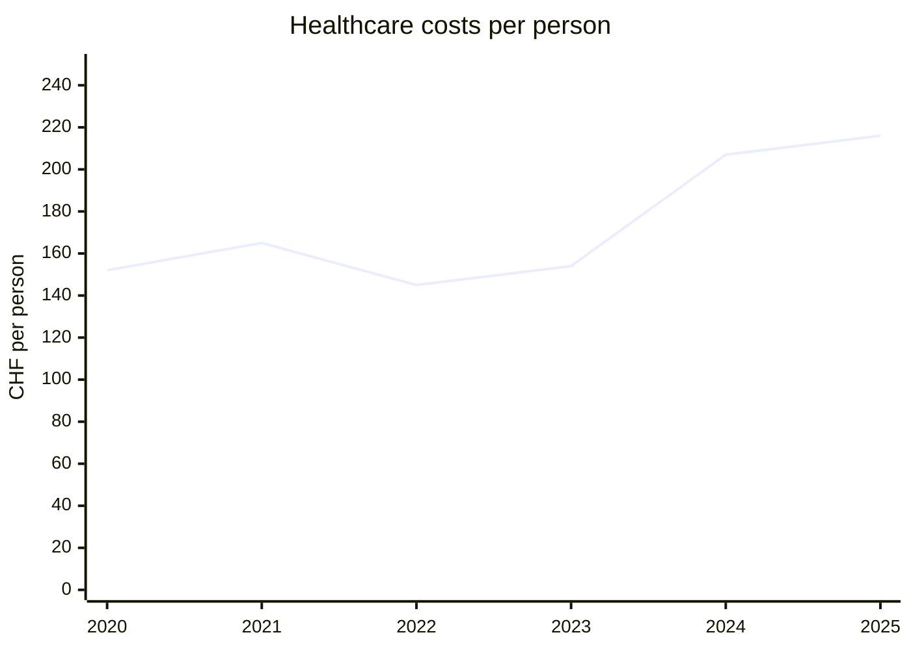
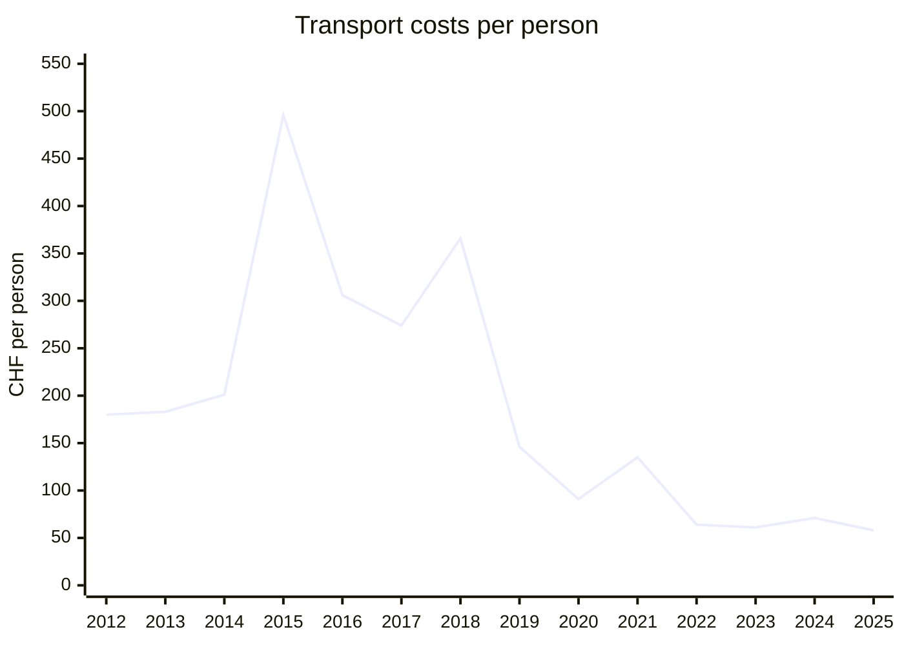
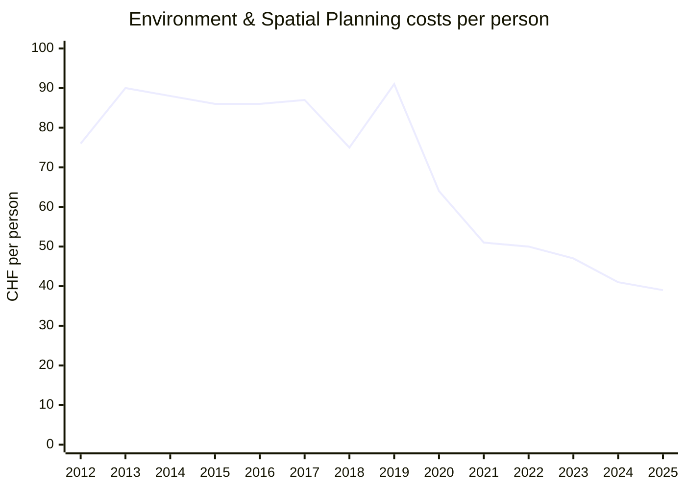

# Finances of the municipality of Beringen

I created a few charts based on the financial statements and budgets of the municipality of Beringen. I may have made mistakes — if you spot one, please let me know.

## Per-capita spending in Beringen

&nbsp;
{:#mermaid}

```mermaid
pie showData
    "Education": 1424
    "Social Welfare": 582
    "Administration": 524
    "Health": 238
    "Culture & Leisure": 146
    "Transport": 82
    "Public Safety": 72
    "Environment & Spatial Planning": 47
    "Economy": 17
```

Beringen takes in CHF 3,010 per resident per year and spends roughly the same amount (CHF 3,133). On their own, these numbers don’t say much — but we can compare them with a neighboring municipality:

## Comparison with Neunkirch

&nbsp;
{:#mermaid}

```mermaid
pie showData
    "Education": 1356
    "Social Welfare": 659
    "Administration": 473
    "Health": 97
    "Culture & Leisure": 138
    "Transport": 273
    "Public Safety": 164
    "Environment & Spatial Planning": 99
    "Economy": 36
```
With CHF 3,213, Neunkirch takes in slightly more per person. It’s striking that Neunkirch spends more than three times as much on transport. On the other hand, it spends far less on health. For public safety, environment & spatial planning, and the local economy, Neunkirch spends about twice as much as Beringen. Comparisons like this can help (for example, as a member of an audit committee) identify where it might be worth taking a closer look.

# Development

The trend over time matters as well: are the figures rising or falling? For example, it is repeatedly claimed that Beringen’s debt is too high, but the numbers don’t support that. Debt has been stable between CHF 34 and 39 million — about CHF 7,000 per resident.

&nbsp;
{:#mermaid}

```mermaid
xychart
title "Debt (Foreign Capital)"
x-axis [2020, 2021, 2022, 2023, 2024, 2025]
y-axis "Million CHF" 0 --> 40
line [38.010, 38.342, 35.781, 34.232, 37.158, 37.756]
```

## Negative developments

Some notable developments show up in per-capita spending by category. The following are increasing, so it may be worth monitoring them more closely.

&nbsp;
{:#mermaid}

```mermaid
xychart
title "Administrative costs per person"
x-axis [2012, 2013, 2014, 2015, 2016, 2017, 2018, 2019, 2020, 2021, 2022, 2023, 2024, 2025]
y-axis "CHF per person" 0 --> 600
line [398, 377, 412, 517, 438, 361, 411, 371, 547, 498, 494, 539, 456, 530]
```

&nbsp;
{:#mermaid}

```mermaid
xychart
title "Public safety costs per person"
x-axis [2012, 2013, 2014, 2015, 2016, 2017, 2018, 2019, 2020, 2021, 2022, 2023, 2024, 2025]
y-axis "CHF per person" 0 --> 80
line [1.9, 36.3, 30.1, 6.5, 14.8, 19.4, 58.8, 45.7, 19.3, 26.9, 50.2, 39.3, 63.0, 70.8]
```

&nbsp;
{:#mermaid}

```mermaid
xychart
title "Healthcare costs per person"
x-axis [2020, 2021, 2022, 2023, 2024, 2025]
y-axis "CHF per person" 0 --> 250
line [152, 165, 145, 154, 207, 216]
```
I start this chart in 2020 because there was a system change, so earlier numbers aren’t comparable.

## Positive developments

On the other hand, there are trends that are pleasing.

&nbsp;
{:#mermaid}

```mermaid
xychart
title "Transport costs per person"
x-axis [2012, 2013, 2014, 2015, 2016, 2017, 2018, 2019, 2020, 2021, 2022, 2023, 2024, 2025]
y-axis "CHF per person" 0 --> 550
line [180, 183, 201, 496, 306, 274, 366, 146, 91, 135, 64, 61, 71, 58]
```

&nbsp;
{:#mermaid}

```mermaid
xychart
title "Environment & Spatial Planning costs per person"
x-axis [2012, 2013, 2014, 2015, 2016, 2017, 2018, 2019, 2020, 2021, 2022, 2023, 2024, 2025]
y-axis "CHF per person" 0 --> 100
line [76, 90, 88, 86, 86, 87, 75, 91, 64, 51, 50, 47, 41, 39]
```

# Is the budget realistic?

The budget must be prepared every year. It is meant to provide guidance on expected revenue and expenditure for the coming year. However, this analytical instrument is repeatedly used to exercise political power and to frame a narrative rather than providing a realistic view into the future. Here we examine the discrepancy between the budget and the actual financial statements. Note that in 2021 an unexpectedly large tax payment arrived from the corporate sector. Every year there are a few items that were not budgeted, but on average they balance out.

I was able to compare budgets and actuals back to 2018. Budget data for earlier years was not available to me.
{:#budget}

| Year | Financial Statement (CHF) | Budget (CHF) | Difference (CHF) |
|------|---------------------------|--------------|------------------|
| 2018 | 49,410                    | 327,000      | -277,590         |
| 2019 | -350,584                  | -218,000     | -132,584         |
| 2020 | -230,101                  | -328,630     | 98,529           |
| 2021 | 1,066,430                 | -205,694     | 1,272,124        |
| 2022 | 124,426                    | -68,785      | 193,211          |
| 2023 | 151,917                    | -197,471     | 349,388          |
| 2024 | -647,740                  | -784,180     | 136,440          |
| 2025 | 708,995                    | -540,095     | 1,249,090        |

2019 was the last time the financial statement came in worse than the budget. On average, the budget is CHF 275,000 too pessimistic, and the median gap is CHF 218,000. This deviation seems systematic. Budgeting is done pessimistically to justify spending cuts or at least to provide arguments against new expenditures. It also allows the municipal council to repeatedly congratulate itself for completing the year better than budgeted. I'm not complaining about a good financial statement, but in my view this is a bit of spin and a misuse of this instrument. I only condemn it to a degree, as budgets are frequently misused for these purposes elsewhere. Nonetheless, I want to record it here.
